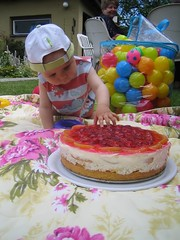

Pues sí, ya hace un año que andamos porestoslares en **geomaticblog.net**. Como recordatorio, el primer post trató acerca de la [Red ERVA de laComunidad Valenciana](/node/7) .

Por una vez, y sin que sirva deprecedente, os molestaremos con un poco de egocentrismo y autobombo (forma parte de la idiosincrasia del _blogger_ por otro lado). En números redondos, llevamos:

- Unos 120 artículos (2 por semana aprox.)
- Unas 50 mil visitas (10 mil en 2006 y el resto en 2007)
- En junio de 2007 tuvimos en suma unos 5000 visitantes distintos (luego con los problemas del blog y el verano la cosa ha caído en picado).
- Hemos rondado las 250 a 300 visitas con algún pico de casi 500 visitantes en un mismo día.
- Tenemos unos 50 suscritos al RSS de los contenidos y unos 20 (estos se merecen ya un premio) a los comentarios.

Tras el verano tenemos un montón de novedades yaque habrá segunda edición del [FOSS4G](http://www.foss4g2007.org)(al que tengo la suerte de poder asistir), [Jornadasde gvSIG](http://www.jornadasgvsig.gva.es/index.php?id=gvsig&L=0), los artículos sobre **LáserEscáner** que nos debe Vicente (si su Tesis Doctoral lo permite), [cierto proyecto](http://wiki.osgeo.org/index.php/Libro_SIG "El Libro de SIG de OSGeo") en el que ando metido y que se merecerá bastante atención en el próximo _curso_, etc etc...

**Un saludo a todos** en nombre de tresamigos a los que nos encanta la geomática y que desdeaquí sólo pretendemos compartir esas noticias,opiniones o tonterías que nos parecen interesantes.

Por cierto, amigos, compañeros de trabajo y carrera o conocidos en la red, si os apetece **colaborar** con algún artículo, ponéos en contacto con nosotros (ya sabréis cómo) porque seguro que os hacemos un hueco, encantados de que por una vez no seamos nosotros los que escribamos.

A ver si nuestros respectivos trabajos y demásresponsabilidades nos permiten tener un hueco de vez en cuando paraasomarnos a la blogosfera para leernos porque seguro que aprendemos **entretodos** un montón en un mundo tan apasionantecomo el de las Ciencias de la Tierra.
