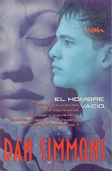
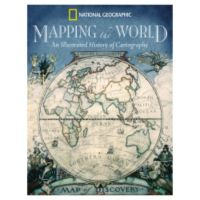

Como mañana es [eldía del libro](http://es.wikipedia.org/wiki/D%C3%ADa_Internacional_del_Libro) y hace poco fue elcumpleaños de un amigo, hoy me he tirado como horaymedia buscando un buen libro que regalarle (bueno, tambiénme he comprado uno para mí, aprovechando la coyuntura).Además hace poco entre cuatro colegas (el anterior, uno deellos) hemos hecho un mega-pedido a [Amazon](http://www.amazon.com)aprovechando la fortalezadel euro frente al dólar (0.63 dólares por euro,la locura). Nos ha salido bien porque pagar menos de tres (3) euros porlibro por portes es casi demencial (al menos para mis ahorros).

¿Que qué leo? Pues vamos a hacer unpequeño repaso de lo libros que tengo cerca...

## Novelas

Despuésde leerme seguidas las dos últimas de [Cornac McCarthy](http://www.cormacmccarthy.com/):[_Noes país para viejos_](http://www.debolsillo.com/ficha_libro/ficha_libro.asp?ident=40251) y [_Lacarretera_](http://www.editorialmondadori.com/ficha_libro/ficha_libro.asp?ident=39839) (esta última con escenassimplemente brutales, te dejan sin aliento, a ver qué hacenal llevarla al cine), he vuelto a uno de los autores que másme han gustado últimamente, [Dan Simmons](http://www.dansimmons.com/). Conlos dos primeros de los [CantosdeHyperión](http://en.wikipedia.org/wiki/Hyperion_Cantos) disfruté como un enano y dehecho me queda la segunda mitad por leer. En fin, [_Elhombre vacio_](http://www.edicionesb.com/Catalogo/Producto.aspx?id=878) (me lo he comprado hoy mismo) es unanovela sobre la angustia de un hombre que sufre el don de latelepatía.

## Cartografía

Al ya archiconocido [ProducingOpen Source](http://producingoss.com/) Software que mecompré el año pasado durante la [ConferenciaMundial sobre Software Libre](http://badajoz07.opensourceworldconference.com/) de Badajoz (este añose hace enMálaga, por cierto), se suma uno que me parece realmentebueno pero que estoy dosificando mucho: _[TheArt of Project Management](http://www.oreilly.com/catalog/artprojectmgmt/)_. En esteultimo pedido a Amazon me he comprado también unlibro de la exitosa serie de O'Reilly [Head First](http://www.headfirstlabs.com/): _[Softwaredevelopment](http://www.headfirstlabs.com/books/hfsd/)_. Los libros de esta serie, como el queme compréhace ya un año de [patronesde diseño](http://www.oreilly.com/catalog/hfdesignpat/) (conocido en la oficinacomo «el libro de la de las coletas») sonrealmente buenos en entretener y aprender de forma muyvisual sobre temas en general arduos y, para qué nos vamos aengañar, aburridos. No son libros con mucha profundidad,pero si eres realmente nuevo en un área, vale la penaempezar con buen pie con un libro de este estilo, ya habrátiempo de subir de nivel con libros más duros.

Mención a parte merece un libro que no esnuevo (lo tengo más de un año) pero que ahora heretomado. Se trata del _best-seller_ [GettingThings Done](http://www.davidco.com/store/catalog/Getting-Things-Done-Paperback-p-16175.php) de [DavidAllen](http://www.davidco.com/), un libro que trata sobre una metodologíapara la gestión personal de tareas y proyectos que se enfocaen «vaciar la cabeza» de tareas tan pronto como seaposible. Es el libro que llevo en la bolsa siempre y que leo en eltransporte público en los viajes del trabajo a casa. Igualun día de estos hasta soy capaz de ejecutar el [GTD](http://es.wikipedia.org/wiki/Getting_Things_Done)....

## Ciencia

Estos en realidad son libros que le compré a Aida,pero que la verdad es que... ¿quien no regala libros paraluego leerlos él también? Ambos son delcientífico [StephenHawking](http://www.hawking.org.uk/home/hindex.html): [_Lateoría del todo_](http://en.wikipedia.org/wiki/The_Theory_of_Everything) un pequeñolibro que recoge varias conferencias de este científico y elenorme [_Dioscreó los números_](http://www.ed-critica.es/detalles_libro_sinopsis.php?ID=978), unarecopilación de los diecisiete mayoresmatemáticos de todos los tiempos, con susbiografías y textos más relevantes anotados porHawking, de los [Elementosde Euclides](http://es.wikipedia.org/wiki/Elementos_de_Euclides) a [Alan Turing](http://es.wikipedia.org/wiki/Alan_Turing).Este libro creo que voy a tardar años en leérmelo, y muchosmás en **entender** todo lo quehay ahí dentro!!!

* * *

Bueno, pues ya está, estos son los libros que tengoesparcidos por mi casa y que cuando puedo voy leyendo a veces paradivertirme y otras para aprender un poco más. No quierohacer un [meme](http://es.wikipedia.org/wiki/Meme "qué es un meme?") de esto pero si alguien se anima a escribir sobre loslibros que le gustan que deje por aquí enlaces.

**¡Feliz díadel libro!**
