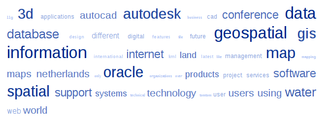

A lo largo de la semana pasada y la corriente he visto dosreferencias, en [Microsiervos](http://i.microsiervos.com/servicios/tagcrowd.html)y en [Genbeta](http://www.genbeta.com/2008/07/30-search-cloud-determina-la-relevancia-de-tus-resultados-de-busquedas),a dos servicios que  hacen cosas muy similares aunque noexactamente lo mismo: nubede etiquetas. Uno lo obtiene como resultado y el otrolo usa como herramienta.

El caso es que me he tomado como ejercicio de Python (de vezen cuando hay que hacer estas cosas o se te oxida la serpiente)elaborar una nube de etiqueta para un texto dado.

Quieras que no siempre puede ser de cierta utilidad, aunquesolo sea como herramienta de análisis de datos... y para que el postsea al menos un poco cartográfico, al final os adjunto la nube deetiquetas [delnúmero 5 de geoinformatics](http://www.geoinformatics.com/asp/default.asp?t=show&id=1420).

El código de Python:

`#coding:latin-1

## # Script que genera una nube de palabras clave a partir de un texto. # La nube tiene 11 clases CSS que representan los distinto tamaños. # Requiere archivo txt con el texto a analizar (cuerpo.txt) # Opcional archivo exclusion.txt con lista de palabras que NO pondrá enla nube # # REFERENCIAS # http://tagcrowd.com/ # http://searchcloud.net/

import re from msvcrt import getch from operator import itemgetter

csCABECERA = """<!DOCTYPE html PUBLIC "-//W3C//DTD HTML4.01//EN" "http://www.w3.org/TR/html4/strict.dtd"> <html> <head> <meta content="text/html; charset=ISO-8859-1" http-equiv="content-type"> <title></title> </head> <body> <!-- Modificado por vehrka del código que puedes encontrar enhttp://tagcrowd.com/

This code and its rendered image are released under the CreativeCommons Attribution-Noncommercial 3.0 Unported License. http://creativecommons.org/licenses/by-nc/3.0/

For commercial licensing, contact Daniel Steinbock, daniel@steinbock.org -->  
 """ csCOLA ="""
 </body> </html> """

class TagCloud: ## Constructor de la clase &n bsp;  # @param psArchTexto Nombre del archivocon el texto # @param psArchExc Nombre del archivo detexto con la lista de palabras a excluir # @param pnLlist Longitudo de la listade palabras a obtener # @param pbFreq parametro booleano paraque muestra la frecuencia junto a la palabra # @param pbTXT booleano para que tambiénsalga la lista en txt def __init__(self, psArchTexto ='cuerpo.txt', psArchExc = 'exclusion.txt', pnLlist = 100, pbFreq = 0,pbTXT = 0): self.word_list = [] self.NomSalida = 'resultado' if self.__Parsea(psArchTexto): # diccionario que almacena las palabras individuales y sus frecuencias freq_dic = {}

# lista de signos de puntuación que aparecen junto a palabras de formamás frecuente punctuation = re.compile(r'[.?!,":;()*%/-]') for word in self.word_list: #remove punctuation marks word = punctuation.sub("", word) #form dictionary try: freq_dic[word] += 1 except: freq_dic[word] = 1 try: # Abre el archivo de exclusion y lo convierte en una lista de palabras exclusion_list = re.split('s+', file(psArchExc).read().lower()) except IOError: print 'No puedo abrir el archivo %s para lecturanContinua laejecucion' % psArchExc exclusion_list = [] # quitar la lista de palabras excluidas for m in exclusion_list: try: del freq_dic[m] except: pass # create list of (key, val) tuple pairs freq_list = freq_dic.items()

# ordena la lista por frecuencia freq_list.sort(key=itemgetter(1), reverse=True)

# lista definitiva de palabras alfa_list = []

# la lista definitiva de palabras la forman las nlist primeras palabasde la lista de frecuencia # suponemos que nadie va a pedir una nube con más palabras que elpropio texto... for m in range(nlist): alfa_list.append(freq_list[m])

# ordenamos alfabéticamente alfa_list.sort()

# diccionario para las clases CSS clases = {}

# recopilamos las frecuencias para las clases clases en un diccionario # así si hay 2 palabras que tienen la misma frecuencia pertencerán a lamisma clase for m in alfa_list: try: clases[m[1]] += 1 except: clases[m[1]] = 1

# como hay que organizar las frecuencias en 11 clases exactas creamosuna lista # con las frecuencias clases_list = clases.items()

# la ordenamos clases_list.sort()

# y la reparimos en clases # la idea es calcular los pasos entre clases # (55 frecuencias distintas en 11 clases resultan en 5 pasos) n = len(clases_list)/11. # h comprueba en que paso estás h = n # i guarda la clase i = 0 # j guarda el paso j = 0 &nb sp;   for m in clases_list: clases[m[0]] = i j += 1 if j > h: i += 1 h += n if pbTXT : self.__ResulTXT(alfa_list) self.__ResulHTML(alfa_list,clases) return

## Función que crea la lista de palabras # @param psFilename Nombre del archivocon el cuerpo de texto a analizar def __Parsea(self,psFilename): _bExito = 0 try: # Abre el archivo de texto y lo convierte en una lista de palabras self.word_list = re.split('s+', file(psFilename).read().lower()) _bExito = 1 except IOError: print 'No puedo abrir el archivo %s para lecturanTerminara laejecucion del programa' % psFilename getch() return _bExito

## Función que da la salida a texto # @param psList Lista de palabras def __ResulTXT(self,psList): # descomentar este texto para obtener un archivo "resultado.txt" con lalista de palabras en texto plano try: filename = '%s.txt' % self.NomSalida out_file = open(filename, "w") except IOError: print 'No puedo abrir el archivo %s para escrituranContinuara laejecucion del programa' % filename getch() return

try: for word, freq in psList: if bfreq: out_file.write('%s %sn' % (word, freq)) else: out_file.write('%sn' % (word))

except IOError: print 'Error escribiendo el archivo %snContinuara la ejecucion delprograma' % filename getch()

out_file.close() return

## Función que da la salida a HTML # @param psList Lista de palabras # @param pdClases diccionario con laspalabras y sus clases def __ResulHTML(self,psList,pdClases): # generamos el archivo para guardar la lista try: filename = '%s.html' % self.NomSalida out_file = open(filename, "w") except IOError: print 'Error escribiendo el archivo %snTerminara la ejecucion delprograma' % filename getch() import sys sys.exit(0)

# guardamos la cabecera (con el estilo RSS) out_file.write(csCABECERA)

# Vamos guardando las palabras en formato HTML try: i=0 for word, freq in psList: # aquí se aplica el boolean sobre mostrar las frecuencias if bfreq: salida = 'n<ahref="">n%s</a>(%s)nn' out_file.write(salida % (i,pdClases[freq],word,freq)) else: salida = 'n<ahref="">n%s</a>nn' out_file.write(salida % (i,pdClases[freq],word)) i += 1 except IOError: print 'Error escribiendo el archivo %snTerminara la ejecucion delprograma' % filename getch()

# guardando la cola out_file.write(csCOLA) # y cerrando el archivo out_file.close() return

if __name__ == '__main__': # NOMBRE DEL ARCHIVO CON EL TEXTO filename = 'geoinformatics_2008_05.txt' # NOMBRE DEL ARCHIVO DE PALABRASEXCLUIDAS (UNA POR LÍNEA) filenameEX = 'en_exclusion.txt' # Nº DE PALABRAS QUE COMPONDRÁ LA NUBE nlist = 50 # BOOLEAN PARA QUE APAREZCA LAFRECUENCIA JUNTO A LAS PALABRAS &n bsp;  bfreq = 0 # BOOLEAN PARA OBTENER RESULTADO EN TXT btxt = 0 TagCloud(filename,filenameEX,nlist,bfreq,btxt)`

El resultado del análisis del número de Julio y Agosto degeoinformatics:

