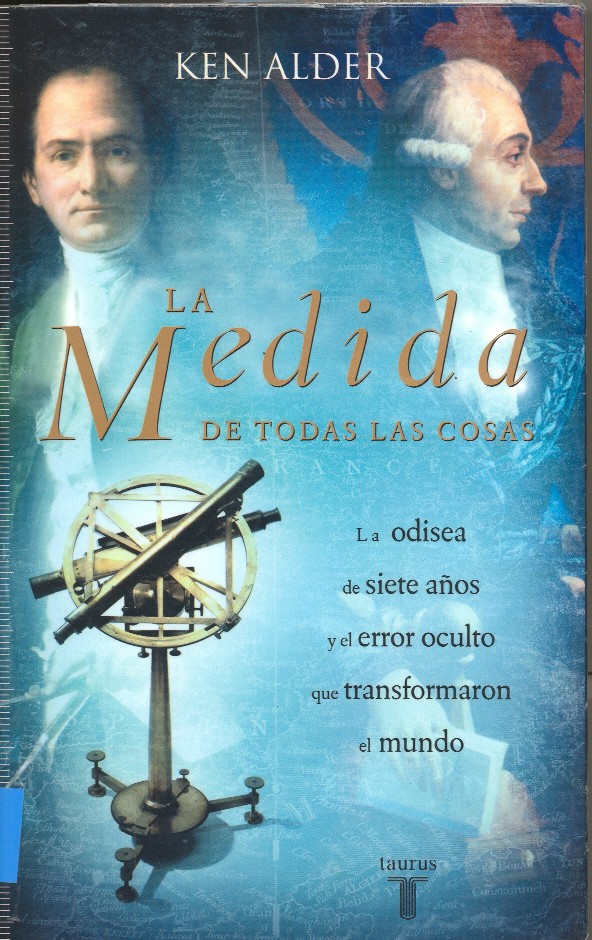

Este blog suele versar sobre temas más o menos actuales relacionados con la geomática y las Ciencias de la Tierra pero este artículo se sale un poco (probablemente no será el último). Hacía ya tiempo que tenía ganas de empezar un libro que un profesor muy querido por [**Geochente**](/gb2/es/user/geochente) nos recomendó hace ya unos cuantos años en un curso de verano en Reinosa: [**La Medida de Todas las Cosas**](http://www.taurus.santillana.es/ld.php?id=442).

Aunque suelo hablar de mis lecturas en el [bloc de Mirihi](http://oblongomirihi.wordpress.com) esta es especial porque une el hobby de la lectura con el de la Geodesia y las Ciencias de la Tierra.

El libro trata sobre los trabajos que llevaron a la determinación del metro y que consistieron en la medición del arco de merdiano, pocos años después de la Revolución Francesa en 1792 por Delambre y Mechain. Con un recién diseñado aparato de una precisón sin precedentes (un segundo decimal) fueron capaces de realizar la medición de una serie de triángulos entre las ciudades de Dunkerke y Barcelona para llegar finalmente a lo que se llama una Base geodésica de la que se calcularía su longitud exacta y de la que se podría extraer la longitud final del metro.

Según el libro (y éste parece serio) uno de ellos, Mechain, cometió un error en sus cálculos del que se dio cuenta después de haberse publicado sus resultados. Si el arco de meridiano entre el polo y el ecuador debía medir diez millones de metros, con el error introducido éste medía realmente 10.002.292 metros. Es decir, habían cometido un error conocido de 0.0002 metros y ya no podía resolverse.

Además de por conveniencia a los ideales revolucionarios del imperio de la razón, la igualdad de los hombres y demás, para definir el metro se buscó un medio que no pudiera ser rechazado por nacionalista o arbitrario, sería una medida derivada de la forma del Mundo.

Si bien en mi opinión este error es puramente anecdótico, me parece mucho más interesante la razón que motivó la _inquietud_ (más bien necesidad) de establecer el sistema métrico decimal. El verdadero motivo para buscar un sistema métrico único era el de siempre: **el dinero**. En aquella época sólo en Francia había centenares de sistemas de medida diferentes, incluso dentro de la misma región. Esto era un verdadero **freno económico**, el comercio era mucho más difícil con tantos sistemas de medidas y desde luego nada práctico.

¿A nadie le suena esto?

Efectivamente, cuando la variedad de sistemas de medida o cualquier otro _estándar_ supone un freno económico, llega alguien que intenta poner orden en dicho caos. En la Francia y Europa de finales del siglo XVIII eran las unidades de distancia y peso, en los años 90 (y siguientes) son los medios para difundir la información geográfica (entre otros).

En aquellos años era la Academia de las Ciencias y actualmente organismos estandarizadores como el [W3C](/gb2/http./www.w3c.org) o el [OGC](http://opengeospatial.org).

La globalización ha llegado con diferentes velocidades, pero parece que ya nos empezamos a poner de acuerdo en algunas formas de intercambio de IG, aunque para conseguirlo no lleguemos a las gestas personales de siglos anteriores.
