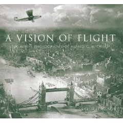

Estaba yo echando un vistazo en Amazon, cuando me apareció un libro llamado ["A Vision of Flight: The Aerial Photography of Alfred G. Buckham"](http://www.amazon.com/Vision-Flight-Aerial-Photography-Buckham/dp/0752444301) de Celia Ferguson, lo que a simple vista parecía un libro más, hizo que me prendiera la curiosidad y tras leer el Review y descubrir la historia de uno de los más grandes fotográfos del mundo (según [The Sunday Times](http://www.timesonline.co.uk/)) tuviese la necesidad de seguir leyendo un poco más de su historia. Existen referencias en la [wikipedia](http://en.wikipedia.org/wiki/William_Alfred_Buckingham), y en diferentes páginas inglesas, si bien la que más me ha llamado la atención es la que aparece en el blog [mi caballo de cartón](http://micaballodecarton.blogspot.com/2008/11/edimburgo-1920-la-fotografa-area-de.html),que os trancribo a continuación. "La primera gran vocación de Alfred G. Buckham (1880-1953) fue la de ser pintor, pero después de ver las obras de [Turner](http://en.wikipedia.org/wiki/J._M._W._Turner) en la [National Gallery](http://www.nationalgallery.org.uk/)de Londres, hizo una hoguera con sus propios cuadros y emprendió su doble carrera de piloto y fotógrafo. Fue el primer jefe de reconocimiento aéreo para la Royal Navy en la Primera Guerra Mundial y más tarde capitán de la Royal Air Force. Después de estrellarse nueve veces, se vio obligado a someterse a una traqueotomía. Pero lejos de abandonar, siguió volando y tomando fotografías aéreas con su pesada cámara.

A 20.000 pies de altitud, sin una cabina protectora, el aire gélido, que penetraba directamente en sus pulmones a través del tubo que tenía insertado en el cuello, no le impedía realizar estas maravillosas fotos. Tampoco era amigo de usar guantes porque decía que estos le impedían trabajar con su cámara en las alturas donde adoptaba arriesgadas posiciones para obtener la imagen deseada.

En 1931, fue destinado para tomar las primeras fotografías aéreas de América del Sur. Arriba puede contemplarse una inusual y magistral vista de una zona desértica de Chile, que parece tomada por un satélite más que por la rudimentaria cámara de Alfred.

Recientemente se ha publicado [un libro](http://www.amazon.co.uk/Vision-Flight-Aerial-Photography-Buckham/dp/0752444301) acerca de este pionero de la fotografía aérea donde se pueden contemplar sus magníficos trabajos.

Reconocimientos:[Scottish National Photography Centre](http://www.snpc.org.uk/contact.php) y [Telegraph](http://www.telegraph.co.uk/news/2123426/Alfred-G-Buckham-aerial-photos.html), en donde puede verse una mini galería de sus obras y relata una breve biografía en inglés."

Para que sirva como referencia, en 1850 el francés [Aimé Laussedat](http://fr.wikipedia.org/wiki/Aim%C3%A9_Laussedat),acuñó los términos Metrofotografía - Iconometría; en 1858 consiguió obtener planos exactos de edificios y pequeñas extensiones de terreno a partir de la fotografía; el término fotogrametría fue acuñado por [Albrecht Meydenbauer](http://de.wikipedia.org/wiki/Albrecht_Meydenbauer)sobre 1867. El primer levantamiento fotogramétrico exitoso de España fue el Levantamiento en el Pinar de Bedar, llevado a cabo en 1896 por J. Pie y Allue (los primeros intentos de obtener pares datan de 1845)

En definitiva, una historia de un pionero de la fotografía aérea, digna de ser adaptada al cine.
