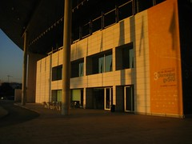

Bueno, mañanaempiezan las [4asjornadas internacionales gvSIG](http://www.jornadasgvsig.gva.es/cas/inicio/), una semana muy larga paraalgunos, como [aquelcómic](http://www.terra.es/personal/fcc00004/semana.htm) de [Superlópez](http://es.wikipedia.org/wiki/Superl%C3%B3pez)(puede que algunos del equipo gvSIG requieran superpoderes para acabarcuerdos esta semanita). Y es que este año vienen **muycargadas**, si ya montar un evento de más de 700 personas(hay unos 1000 asistentes previstos, más o menos) es un reto, hacerloademás coincidiendo en el tiempo y el espacio con una [reunióntécnica para miembros de OGC](http://www.opengeospatial.org/event/0812tc) y a la vez el [Eclipse-Day](http://www.moskitt.org/cas/eclipseday/),es una pequeña **proeza organizativa** (mienhorabuena "_de antebrazo_" para todos losorganizadores).

Por mi parte esteaño no tengo actos formales previstos, salvo ayudar con el [tallerde gvSIG mobile](http://www.jornadasgvsig.gva.es/cas/talleres0/). Nada que ver con las tres ponencias del añopasado. Así que voy a intentar asistir realmente a las jornadas, si medejan. Se puede consultar el [programadetallado](http://www.jornadasgvsig.gva.es/fileadmin/conselleria/Documentacion/programa/Programa_4as_Jornadas_gvSIG.pdf) (PDF), pero hagamos aquí un pequeñoresumen-adelanto. Vamos a ver: 

### Talleres

Todo un día de talleres, nada menos que 10 en tres auditoriosen paralelo. Esto por supuesto te lleva a  elegir qué áreas degvSIG te interesa conocer de primera mano (de la de sus desarrolladoresy analistas, vamos). Aquí tenemos dónde elegir, desde aspectos másorganizativos como el taller de gestión colaborativa o el deinformación espacial en cooperación al desarrollo, a otros técnicoscomo gvSIG 3D o gvSIG Mobile o a aquellos dirigidos adesarrolladores.

### Sesiones plenarias

El primer díacierra la sesión de talleres Michael Gould, no sabemos de qué hablarápero seguro que resulta interesante, y hasta puede que nos deleite conalguna foto maja (me estoy acordando de una de las 1as jornadas con [espuma](http://www.jornadasgvsig.gva.es/fileadmin/conselleria/Documentacion/jornadas/sesion2/Infraestructuras_de_Datos_Espaciales.pdf)...).

El segundo día comienza con dos conferencias de ámbitointernacional, una sobre el uso de gvSIG en el registro de la propiedady la otra del uso de gvSIG en el área forestal del compañero AlessandroSgambatti. Después Gabi nos hará el informe de estado de gvSIG, unaconferencia a la que hay que ir, sí o sí ;).

Hay una mesa redonda pero todavía no aparece la temática en elprograma, a ver si mañana pregunto a los organizadores y actualizo esto.

Finalmente el viernes antes de la sesión de clausura hay tresponencias plenarias con la intervención de Càrol Puig (UPC), CarlosFigueira (CNTI, Venezuela) y Fidel García (Conselleria de Industria yComercio, GVA).

### Ponencias

Hay un total de 10 sesiones más con 2 o 3 ponencias cada una,corriendo en dos auditorios en paralelo. Aquí no voy a dar más datos porque muchos de los ponentes son amigos y por tanto no seríajusto con el resto. Sólo destacar (con vuestro permiso) que habrá unacomunicación sobre [OSGeo-es](http://es.osgeo.org),con [Lorenzo](http://www.ominiverdi.org)y [Vehrka](http://geomaticblog.net/gb2/es/user/vehrka)informando al respetable de qué estamos haciendo actualmente en elcapítulo hispanohablante.

### Eclipse-Day

No sé si podréasistir, pero me gustaría ya que algunas ponencias de esta jornadaserán impartidas por compañeros de [Prodevelop](http://www.prodevelop.es) queestán trabajando en el proyecto [Moskitt](http://www.moskitt.org)(MOdelling Source Kit), a ver si no me enmarrona nadie y puedoestar por allí.

### Extras

Pues como en todaslas jornadas gvSIG seguro que hay oportunidades para charlar (_networking_en fino), discutir, oír quejas y piropos, algo de asueto en las cenasque nos toque ir, alguna sorpresa que venga de tierras extremeñas y endefinitiva, mucha vida social entre gente **geo**,menos mal que luego hay puente hasta el martes!!
