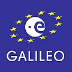

Bien aquí añadiré algo a lo comentado en [el blog de Txus](http://txus.cartesianos.com/archives/161) (creo que lo escribió Toni porque es quien contesta a los comentarios). En general simplemente añadiré algunas notas personales. En cualquier caso recomiendo la lectura de su artículo. Lo primero es comentar que este evento fue organizado por el Instituto de Aplicaciones de las Tecnologías de la Información y Comunicaciones Avanzadas ([ITACA](http://www.itaca.upv.es/)) de la UPV. Este evento no fue suficientemente publicitado y yo de hecho me enteré porque [Prodevelop](http://www.prodevelop.es) ha colaborado con el evento, que si no... Así que la asistencia fue más bien floja para la sala en la que se llevó a cabo (nada menos que el Museo Príncipe Felipe de la Ciudad de las Ciencias) y probablemente un poco más de publicidad hubiera llevado a más profesionales. Todo esto suponiendo que la finalidad del evento era publicitar [Galileo](http://www.esa.int/esaNA/galileo.html) y [EGNOS](http://www.esa.int/esaNA/egnos.html) a las empresas que trabajan en temas relacionados con la localización, claro.

 Bien, el primer día además de la típica inauguración institucional (que me perdí) asistí a una muy buena presentación de Pedro Luis Molinero de Hispasat describiendo los servicios y características de Galielo donde destacó que el programa ya va justo en el calendario y si no se cumplen los plazos el sistema podría verse comprometido por la entrada del sistema chino (COMPASS). También es de destacar sus comentarios sobre cuál es la piedra que dificulta el camino de Galileo y que yo resumiría en «_ya podía haber echo mejor tiempo en aquel verano de 1588_».

Después se hicieron dos presentaciones virtuales, es decir pre-grabadas, donde la verdad es que no puedo comentar nada destacable porque eran más bien organizativas, alrededor del [7º programa marco](http://ec.europa.eu/research/fp7/), proyectos de I+D y cosas así.

Después de comer tuvimos dos mesas redondas, la primera fue en mi opinión bastante pobre, y se entiende porque realmente la gente no tiene una idea clara de lo que Galileo va a aportar frente a GPS. Así, un representante del sector de la ingeniería civil, otro del mundo de la agronomía y otro del de aviación civil (caray parece un chiste) fueron contestando a las preguntas del moderador. Básicamente redundaron en la obviedad, que si Galileo ofrece más precisión (lo cual es cierto pero no tanto como muchos piensan) pues miel sobre hojuelas.

La segunda mesa redonda fue llevada por un representante de [GMV](http://gmv.es/) (Javier Megías) y Miguel Montesinos de [Prodevelop](http://www.prodevelop.es). Ambos presentaron sus respectivas empresas y a continuación fueron contestando a las preguntas del moderador sobre las ventajas desde su punto de vista y también el de sus clientes sobre la adopción de Galileo. Puedo destacar que Javier comentó que para las empresas de _hardware_ Galileo no va a suponer mucho más negocio del actual y no hay muchas oportunidades nuevas de negocio, pero ambos destacaron una de las claras oportunidades de Galileo, la navegación en cuidad donde los llamados _cañones urbanos_ dificultan la navegación con un numero limitado de satélites. El uso combinado de GPS, Galileo y puede que GLONASS y COMPASS sumaría los satélites suficientes en un ambiente tan restrictivo para poder navegar con fiabilidad.

El segundo día fue una sesión sólo de mañana.  La primera ronda fue para los representantes de los _clusters_ aeroespaciales de Valencia y Madrid, comentando los proyectos en los que están trabajando (especialmente con EGNOS). La segunda sesión fue enteramente desarrollada por un representante de Air Nostrum. Comentó que gracias a EGNOS, que es de esperar que se certifique para aviación civil el año que viene, se podrán realizar aproximaciones a aeropuertos con un nivel de precisión análogo al conseguido al utilizar elementos de ayuda en el aeropuerto (conocidos como [ILS](http://es.wikipedia.org/wiki/Sistema_de_aterrizaje_instrumental) y que no todos los aeropuertos disponen). Esto se traduce en varias cosas: por un lado se podrán realizar aproximaciones de este tipo en cualquier aeropuerto, además podrán hacerse en peores condiciones de visibilidad al bajar el umbral de altitud en el que el piloto debe tener contacto visual con la pista y finalmente se está estudiando la posibilidad de poder planificar aproximaciones siguiendo descensos en curva, imposibles ahora mismo con los sistemas de ayuda actuales, pero posibles con un sistema basado en GNSS. Todo esto lo comentó mostrando un par de vídeos de pruebas con aviones comerciales de Air Nostrum, en pruebas reales en el aeropuerto de Valencia, entre otros.

La última sesión de la mañana fue para las aplicaciones en la geomática. La segunda ponencia que más me gustó del evento después de la de Hispasat fue la del Ingeniero Geográfo Javier González Matesanz, en la comentó cuáles son las implicaciones de Galileo para el campo de la geodesia. El resumen de su ponencia sería que Galileo no aporta mucha más precisión geométrica, aporta realmente mucha **más fiabilidad**, precisión en la determinación del **retraso ionosférico** y tiempos de adquisición de señal mucho **más rápidos**. A continuación expusieron Raquel Capilla e Israel Quintanilla del [ICV](http://www.icv.gva.es) y el [DICGF](http://www.upv.es/entidades/DICGF/indexc.html) respectivamente comentando los trabajos que están haciendo actualmente y sucintamente cómo afectará Galileo sus actuales proyectos.

Añado aquí un [twitt](http://twitter.com/xurxosanz/status/1593268221) que hice durante el evento:

> un geodesta si no saca una tabla de precisiones en una charla revienta

Destacaría algo comentado por los tres y que es bastante interesante: con Galileo tendremos un mejor modelo ionosférico, que redundará en una mayor cobertura de las redes geodésicas activas. Es decir, si ahora tenemos que hacer redes de estaciones permanentes con una separación de unos 50 a 70 kilómetros ya que un receptor no puede estar a menor distancia de alguna estación para poder tener precisión suficiente, con Galileo estas distancias **aumentan bastante** sin perder fiabilidad más allá de los 100 kilómetros. Esto va a permitir instalar redes geodésicas activas más extensas con el mismo número de receptores, lo que sumado al incremento (esperemos) en la cobertura de GPRS y 3G va a permitir tener cobertura geodésica de alta precisión en un mayor número de escenarios y a menor coste.

En fin, mi percepción personal **es positiva**, creo que sí, que se va a llegar a tiempo y que tanto EGNOS primero como Galileo después van a ser proyectos que acabarán calando en la sociedad, permitiendo ampliar el uso de los sistemas de navegación hacia sectores todavía no abordados y con una gama de servicios mucho mayor. Aunque no veremos aviones civiles sin piloto como preguntaba alguien, pero se parecerá mucho a aquel capítulo de los _Simpsons_ en el que los camioneros confabulan para que no se sepa que realmente ellos no hacen gran cosa porque un piloto automático les hace todo el trabajo.
