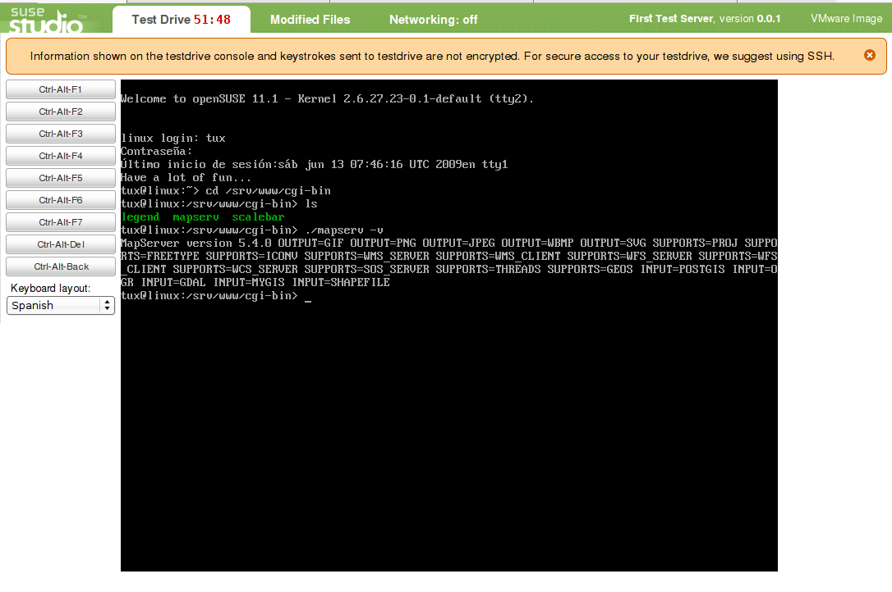
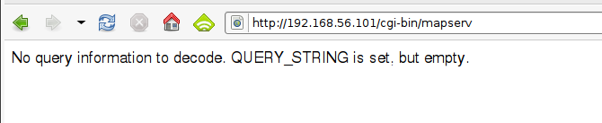

[SUSE](http://es.opensuse.org/Bienvenidos_a_openSUSE.org) es una de las grandes distribuciones del Sistema Operativo GNU/LInux. Hace ya unos años que fue adquirida por [Novell](http://www.novell.com/linux/) y que adoptó la solución de [RedHat](http://www.redhat.es/) de ofrecer una versión para la comunidad y otra de pago. Bueno, el caso es que hace ya unos meses se anunció que Novell estaba preparando [SUSE Studio](http://susestudio.com/), una aplicación web en la que se podrían generar [appliances](http://en.wikipedia.org/wiki/Virtual_appliance), máquinas virtuales basadas en SUSE (tanto la versión libre como la de pago). Estas versiones serían personalizadas, ya que se podrían configurar a través de una interfaz web y para más tarde descargarlas y usarlas donde quieras.

El servicio estaba en pruebas con acceso privado y solicité el alta. Pues nada, esta mañana me ha llegado el correo en el que me avisaban de ya podía darme de alta (usando [OpenID](http://es.wikipedia.org/wiki/OpenID) por cierto) y he estado trasteado un poco.

La aplicación es muy sencilla de usar y no la voy a describir aquí, otros seguro que lo harán mejor que yo. Tan solo comentar que es **intuitiva**, en muy pocos pasos puedes tener tu máquina virtual montada y lista para descargar. La configuración de paquetes de software es inmediata, y ahora viene lo bueno, puedes añadir otros repositorios con lo que puedes añadir paquetes de terceros. Yo he añadido sobre una máquina virtual para servidor (sin ventanitas ni gráficos) el repositorio [Geo](http://download.opensuse.org/repositories/Application:/Geo/) y he podido añadir a los sospechosos habituales de la tribu C: postgis, mapserver, gdal, proj. Además he añadido Tomcat, Apache y  mod\_python para que el sistema esté listo para reicibir a los compañeros de las tribus de Java y Python.

\[caption id="attachment\_417" align="aligncenter" width="450" caption="Selección de paquetes en SUSE Studio"\]\[/caption\]

Una vez configurados los paquetes uno puede elegir idioma, logotipos y fondos de las pantallas de arranque, configuración de usuarios, habilitar el firewall e incluso subir tus propios ficheros a la distribución para poder por ejemplo generar tu appliance ya con tus propios desarrollos si quieres.

Finalmente te permite generar una imagen para USB, un fichero para VM Ware o para el sistema de virtualización Xen. No, no está [Virtual Box](http://www.virtualbox.org/) pero éste acepta las imágenes de disco de VM Ware por lo que no hay problema.

\[caption id="attachment\_415" align="aligncenter" width="368" caption="Arrancando la máquina con Virtual Box"\]\[/caption\]

Disopne además de una interfaz en flash para probar la imagen directamente en la red, pero es actualmente poco usable, ya que casi no responde a las interacciones, con consola y paciencia aguanta, pero con un escritorio... ni hablar.

\[caption id="attachment\_418" align="aligncenter" width="450" caption="Ejecutando la máquina virtual vía web"\]\[/caption\]

Bajada la imagen, sólo he tenido que montarla con Virtual Box como Host-only para que mi máquina anfitriona vea a la virtualizada y ya tenemos el clásico mensajito con el que empieza la diversión....

