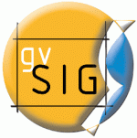

Durante esta semana, en los cuarteles generales del proyecto [gvSIG](http://gvsig.org) se ha organizado un pequeño seminario orientado a los desarrolladores que están empezando a trabajar con gvSIG 2.0. La idea era dar a los desarrolladores el máximo de documentación e información sobre las novedades que se han introducido, que afectan de lleno al desarrollo del producto porque tocan (entre otras cosas) tres aspectos fundamentales: el modo de compilar los binarios, las bibliotecas de acceso a datos y la API de geometrías.

Han sido tres días de ver diagramas UML y muchos _javadocs_, y la impresión general de los asistentes ha sido muy positiva. La llamada no se hizo extensiva a la comunidad porque el sitio disponible no era mucho y quedó copado con los desarrolladores que ya están trabajando sobre 2.0 (o lo van a tener que hacer en breve), por tanto no ha sido posible (esta vez) ofrecer la asistencia al seminario de forma abierta.

Hemos tenido la suerte de que la [Conselleria](http://www.cit.gva.es) ha dispuesto de equipo para poder grabar todo el seminario (algo menos de 20 horas en total) por lo que en cuanto estén los vídeos preparados se colgarán para que toda la comunidad los pueda disfrutar. Se trata de muchas horas con los expertos que andan tras las trincheras del desarrollo de lo más nuevo de gvSIG y por tanto un recurso que no tiene precio.

Igualmente las diapostivas y demás material creado para el seminario se colgará en cuanto se habilite el espacio. Para empezar toda la [documentación](https://gvsig.org/web/docdev/gvsig_desktop_2_0/) elaborada está ya en el portal y por tanto accesible para todo el mundo. Igualmente ya empiezan a subirse (todavía de forma experimental aunque es de esperar que no cambien de ubicación) los [primeros _sites_](http://downloads.gvsig.org/pub/gvSIG-desktop/docs/reference/) que albergan toda la documentación generada por [Maven](http://maven.apache.org/), el nuevo motor de construcción de binarios. Estos _sites_ contienen un buen número de informes generados automáticamente a partir de la evaluación del código fuente y van a suponer un buen recurso para ver lo “saneado” del código, la cobertura que se está haciendo en los tests, etc.

Si todo va bien este seminario se repetirá, aunque no se puede asegurar ninguna fecha todavía. Igualmente, en las [5as Jornadas gvSIG](http://jornadas.gvsig.org/) se hará una versión reducida del mismo así que si todavía no tenías claro si valía la pena venir a Valencia, ya tienes una excusa más que darle a tu jefe.
