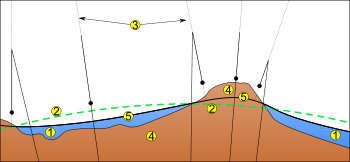

Sí, amigos, como delata el título de esta entrada soy bastante profano en el tema de la geodesia. En primer lugar presentarme, que soy nuevo por aquí y mis papás me enseñaron a ser educado, o lo intentaron. Soy Juangui Jordán, un teleco metido a informático metido a geoinformático. Un intruso dentro de un intruso.

Estoy embarcado en gvSIG, en la librería de acceso a dispositivos de  localización libLocation. Hoy me ha surgido un tema curioso que Jorge me ha sugerido que postee en geomaticblog. El tema podría titularse, **la interpretación de las alturas en dispositivos GPS**, aunque también podría llamarse **por qué los informáticos siempre tenemos la culpa de todo**. Y es el siguiente.

Estoy implementando el protocolo NMEA, uno de los protocolos usado por los dispositivos GPS para comunicarse con otros equipos. Es muy sencillo, basado en texto plano, y por ello ha sido adoptado por la mayoría de fabricantes. Existe un estándar que dice cómo se interpreta ese protocolo, pero hay que pagar por él. Al parecer nadie lo compra, ni siquiera los fabricantes de GPS, así que al final cada cual lo interpreta a su manera, desarrolladores y fabricantes. Por ello, el uso de NMEA da lugar a distintas interpretaciones, y quebraderos de cabeza, a desarrolladores -que se lo cuenten a los creadores de [GPSd](http://gpsd.berlios.de/)\- y usuarios.

Uno de los problemas, el que me ha tenido hoy entretenido toda la mañana, es el de las alturas. El mensaje GGA informa de la altura del GPS mediante 2 campos. El siguente extracto sería un ejemplo de mensaje GGA:

$GPGGA,212734,5057.8332,N,00647.5003
,E,1,07,1.1,72.9,M,47.2,M,,\*77

Según lo más parecido al estándar que se puede consultar -varias páginas web que tratan de recoger el sentido de cada campo- los valores de altura serían:

- Altura ortométrica: 72.9m
- Separación del geoide: 47.2m

\[caption id="" align="aligncenter" width="350" caption="1. Océano - 2. Elipsoide - 3. Desviación local 4. Continente 5. Geoide"\]\[/caption\]

Para no marear demasiado, aclarar que **la altura ortométrica es la altura sobre el nivel medio del mar**, lo que un usuario esperaría que se parezca a 0m cuando se encuentra en la playa, y **la separación del geoide es la diferencia positiva entre el geoide  y el elipsoide**. **El [geoide](http://es.wikipedia.org/wiki/Geoide "Geoide en wikipedia") viene a ser justamente el nivel medio del nivel del mar**, un modelo de la Tierra gravitacional y mesurable mediante equipos, pero muy difícil de expresar en términos matemáticos (parecido a una fea patata) mientras que **el elipsoide es un modelo matemático de la superficie de la Tierra** (un bonito huevo), expresable en forma matemática con sólo unos pocos parámetros.

\[caption id="" align="aligncenter" width="490" caption="El geoide es como una patata"\]\[/caption\]

El elipsoide es el modelo que usan los GPS para calcular la altura elipsoidal, si bien muchos GPS hoy en día tienen un modelo del geoide que usan para calcular la altura sobre el nivel del mar, que es la que le suele interesar al usuario. Por tanto lo que la norma NMEA propone es _"dele usted al usuario la altura sobre el nivel del mar"_ y, para el caso de que el usuario sea un usuario avanzado _"dele la separación del geoide"_ también. Así, si tenemos un modelo del geoide más preciso podemos hacer los cálculos de nuevo.

Generalmente -a groso modo- se cumple que:

altura\_elipsoidal = altura\_ortometrica + separacion\_geoide

Así, si te dan 2 valores, es fácil calcular el que falta.

Hasta aquí la norma o supuesta norma, ya que nadie ha visto una copia de ese estándar. Lo que pasa después es que cada fabricante pone lo que quiere en el primer y el segundo campo y nos encontramos con que:

- Hay GPS que siguen la norma.
- Otros sólo dan la altura ortométrica, pero no la separación del geoide (bastante estúpido por su parte, ya que para calcular la ortométrica han tenido que usar necesariamente un modelo de geoide).
- Otros dan la altura elipsoidal y la separación del geoide.
- Otros sólo dan la altura elipsoidal, sería el caso de GPS modestillos que no tienen modelo del geoide y sólo son capaces de triangular satélites.

**Conclusión. Cuando un programa interpreta este mensaje no sabe a ciencia cierta cómo interpretar las alturas.** Aunque siga la norma, siempre habrá dispositivos GPS que te estarán dando una altura elipsoidal en lugar de ortométrica.

Entonces es cuando el usuario, sentadito en su silla de playa, y ve que tu programa le indica que está a 100m sobre el nivel del mar, como es lógico piensa "estúpidos programadores".

La pregunta sería cómo arreglar esto para que, en lo posible, el usuario pueda ver la altura que le interesa, y de paso no se acuerde de la madre del programador.

Lo ideal sería **tener una base de datos de todos los modelos de GPS**, y poder autodetectar a qué tipo de GPS se ha conectado, interpretándolo consecuentemente. Para esto haría falta la contribución de muchos usuarios que nos dijeran cómo interpreta cada modelo el mensaje GGA, y luego tener la suerte de que cada modelo nos indique su identidad en un mensaje NMEA, lo cual no siempre sucede.

Lo siguiente menos malo sería **tener una opción de configuración en la parte del programa que interpreta NMEA**, que le permita al usuario, mediante alguna casilla, decir si su modelo de GPS devuelve alturas ortométricas o elipsoidales. Por defecto se deja en ortométricas, que es lo normativo, pero das la posibilidad de cambiarlo.

Así, nuestro sufrido informático siempre podrá excusarse en que **el usuario no leyó toda la documentación** :P

A pesar de todo, siempre existirá el caso de GPS que sólo dan la altura elipsoidal, con lo cual no puedes dar al usuario de a pie la altura sobre el nivel del mar. Aquí la solución sería informar del tipo de altura que está recibiendo, y quizás recomendar que se compre otro GPS.

\[caption id="" align="aligncenter" width="334" caption="Este no leyó la documentación (fuente babasteve)"\]\[/caption\]
