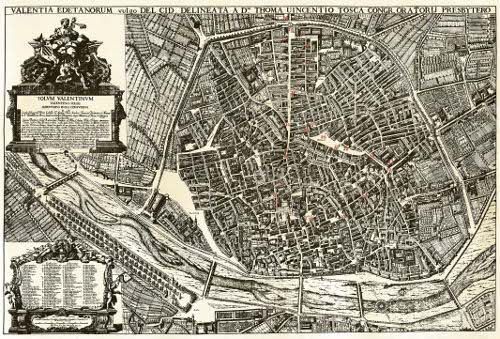

\[caption id="attachment\_482" align="aligncenter" width="500" caption="Valencia, 1704"\]\[/caption\]

Apunte corto para compartir una imagen (pinchando en la del post) del mapa de [Tomás Vicente Tosca](http://es.wikipedia.org/wiki/Tomás_Vicente_Tosca) de la ciudad de Valencia realizado en 1704, que [Juan Lucas](http://gvsigmobileonopenmoko.wordpress.com/), un compañero de trabajo ha localizado navegando por Internet.

Este post está patrocinado por [Prodevelop](http://prodevelop.es), a quien le he robado 5 minutos para escribirlo ;-).
