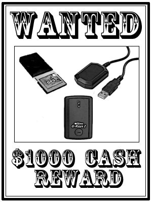

Si usted ha visto alguno de estos GPS, comuníquenoslo cuanto antes. Su colaboración ciudadana será remunerada.

El asunto es el siguiente. Hoy en día hay muchos GPS cuyo chipset admite correcciones RTCM. Un ejemplo es el Atmel-uBlox ATR 0625, y hay unos cuantos más.

El problema es que cuando los fabricantes montan estos chipset en un GPS de consumo, no se molestan en conectar los pines del puerto de entrada de datos RTCM. Por descargar de culpa a estos fabricantes hay que decir que también habría que habilitar un segundo puerto serie, lo cual se traduce en costes.

¿Y qué nos estamos perdiendo? Bueno, estos GPS de los que os hablo suelen tener lo que llaman WAAS o EGNOS, que permiten correcciones diferenciales por satélite geoestacionario. Sin embargo, en ciudad, los satélites geoestacionarios EGNOS no suelen ser visibles por lo que resulta poco útil esta capacidad. Por otro lado, las correcciones RTCM se pueden obtener de manera continua por internet, a través del protocolo NTRIP. Con la disponibilidad de tarifas planas asequibles para móviles empieza a ser una opción interesante para obtener mejor precisión (entre 1 y 3 m).

Me sorprendía que no hubiera ningún fabricante que se haya molestado en crear un modelo, aunque más caro, que permita las correcciones RTCM. He buscado bastante y he encontrado algunos, aunque la información es muy poco clara en las especificaciones y manuales. He escrito a algún fabricante sin respuesta.

Estos son los GPS de consumo que he encontrado que supuestamente admiten correcciones RTCM:

- **Wintec WBT-300 / G-Rays I.** GPS bluetooth que cuesta unos 60$
- **Conrad CR4.** Mi segunda opción, ya que se conecta por USB. Por 50€.
- **Holux CF GR-271.** Receptor CF, sólo para PDAs antiguas o portátiles. Ya no se fabrica, a la venta por eBay por unos 100€.

Como veis son GPS bastante raritos, ninguno a la venta en España. No me atrevo a comprarlos sin estar seguro de que tienen un puerto serie habilitado para enviar las correcciones RTCM. Si alguien tiene uno de estos modelos, podría indicarle cómo probarlo.
