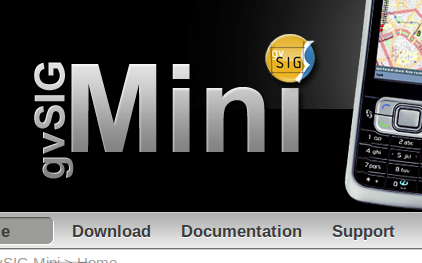

Miguel Montesinos, CTO de [Prodevelop](http://prodevelop.es) y mi jefe para más señas ha posteado por diversas listas este mensaje anunciando el lanzamiento de un  pequeño (o no tanto) proyecto para dispositivos móviles:

> Hola a tod@s,
> 
> anunciamos el nacimiento de gvSIG Mini, un nuevo proyecto open source (GNU/GPL) dirigido a teléfonos móviles Java y Android. gvSIG Mini es un visor libre de mapas de libre acceso, con cliente WMS, WMS-C, búsqueda de direcciones, POIs, rutas, entre otras funcionalidades.
> 
> gvSIG Mini ha sido desarrollado por Prodevelop.
> 
> Estamos encantados de poder contar con comentarios, sugerencias, contribuciones,... Estamos abiertos a colaborar con todo aquél que esté interesado en este proyecto u otros similares.
> 
> Más información en [http://www.gvsigmini.org](http://www.gvsigmini.org/)
> 
> Saludos
> 
> Miguel Montesinos Director Técnico PRODEVELOP, S.L. [http://www.prodevelop.es](http://www.prodevelop.es/)

Este proyecto, por contar un poco más del asunto, es una evolución del cliente para dispositivos móviles que fue desarrollado para un [GIS de turismo](http://194.179.111.10:8090/widget/ "SIGATEX") de la consejería de turismo de la Junta de Extremadura. Este proyecto entre otras cosas, solicitaba un cliente útil por cualquier ciudadano que le diera acceso a cartografía temática de ámbito turístico (bares, monumentos, albergues, etc.) así como a varias capas de información base (ortofotos, carreteras, etc.). Este proyecto además fue presentado en las últimas jornadas de SIG Libre de Girona ([artículo en PDF](http://www.sigte.udg.edu/jornadassiglibre2009/uploads/Articulos/C30.pdf)) y se puede ver [una presentación muy buena](http://www.slideshare.net/albertoromeu/sigatex-mvil) sobre el proyecto de la mano del principal desarrollador de la aplicación.

Hecha la aplicación vertical, se consiguió apoyo económico para desarrollar un cliente más genérico que fuera útil a cualquier persona, permitiendo acceder no sólo a la cartografía de Google Maps (eso ya lo hacen otras aplicaciones) sino a otros servicios comerciales (Yahoo y Bing) como muy especialmente cartografía libre (OpenStreetMap) y más aún, cualquier servicio WMS que el usuario quisiera utilizar. Obviamente este último servicio será sólo útil para gente del mundillo _geo_, pero bueno, es soft libre y abre las puertas a desarrollar cualquier otro tipo de aplicación vertical que requiera servicios WMS específicos.

Finalmente la aplicación además de mostrar estos servicios de cartografía, hace uso de servicios de cálculo de rutas y búsqueda de puntos de interés utilizando proyectos relacionados con OpenStreetMap.

Posteriormente se ha desarrollado una versión que todavía se puede considerar bastante "alpha" para ser utilizada en dispositivos Android, visto que la plataforma está ganando cada vez más usuarios y es un mercado muy interesante.

Yo llevo usando la aplicación Java en mi teléfono ya un tiempo (para ver cartografía no uso el servicio de rutas demasiado) y es muy estable y rápido, se lo recomiendo a todo el mundo que pueda permitirse bajarse unos KB de internet sin que le suponga un gasto enorme.

¿no está mal para ser tan mini no?

Actualización: meto después del leer más la presentación que ha hecho [Javi Carrasco](http://krisish.blogspot.com/) y que ha posteado también en [el blog de Prodevelop](http://www.prodevelop.es/es/blog/09/10/26/foss4g-2009). \[slideshare id=2348775&doc=gvsigminirev-091026074813-phpapp01\]
