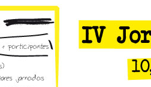

> Lluis Vicens del [SIGTE](http://www.sigte.udg.es/) nos pasa esta pequeña nota sobre las próximas jornadas de SIG Libre de Girona.

Saludos a todas y todos,

Nos resulta especialmente grato poder anunciar la edición de las IV Jornadas de SIG Libre, que van a tener lugar en Girona los días 10, 11 y 12 de Marzo de 2010. En el [sitio web](http://www.sigte.udg.edu/jornadassiglibre/) de las Jornadas de SIG Libre encontraréis información relativa a las [Ponencias Plenarias programadas](http://www.sigte.udg.edu/jornadassiglibre/keynotes), el programa de [Talleres prácticos](http://www.sigte.udg.edu/jornadassiglibre/programa/talleres), así como [otra información](http://www.sigte.udg.edu/jornadassiglibre/fechas) que os puede resultar de interés.

Desde aquí os animamos a participar de forma activa en las jornadas, presentando vuestras propuestas de comunicación entre hoy y hasta el próximo día 10 de Noviembre, fecha en la cual expira el período para la recepción de resúmenes (300 palabras). En el sitio web de las Jornadas, apartado comunicaciones, encontraréis las plantillas para la presentación de resúmenes. Contamos con vuestra siempre interesante participación en el evento para conseguir entre todos, unas jornadas aun más atractivas y productivas.

Aprovechamos para informar también que la [aplicación de inscripción](http://www.sigte.udg.edu/jornadassiglibre/inscripcion), ya se encuentra activa en el sitio web de las jornadas. Quedamos a vuestra disposición para responder a cualquier duda que pueda surgir a través de la dirección de correo infojornadas@sigte.udg.edu

Nos vemos en Girona! Muchas gracias por vuestra atención. Saludos,

Lluís
