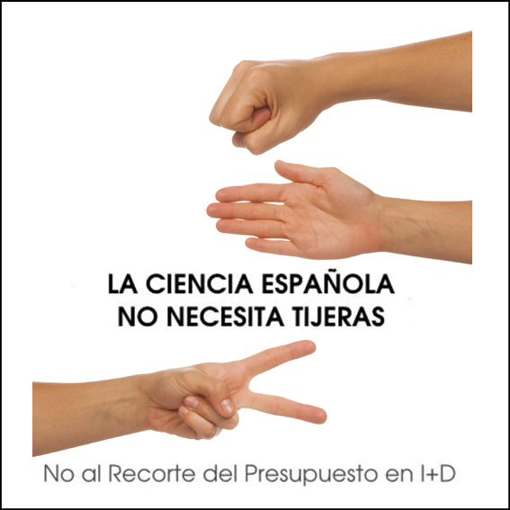

Desde geomaticblog también queremos unirnos a la campaña iniciada por Javier Pelaez en su blog [La Aldea Irreductible](http://aldea-irreductible.blogspot.com/2009/10/la-ciencia-en-espana-no-necesita_07.html).

Hay días en los que te parece que vives en un país de pandereta, este es uno de esos días en los que hay que recordar que queda mucho que educar en la sociedad, sobretodo entre quienes "nos mandan".
