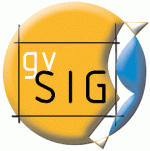

Por fin, lentamente se va distribuyendo a lo largo de las listas de correo [el siguiente mensaje](http://listserv.gva.es/pipermail/gvsig_usuarios/2009-November/010910.html) de la oficina de comunicación de gvSIG:

> gvSIG ha hecho pública una nueva versión estable de su aplicación de escritorio: gvSIG Desktop 1.9.
> 
> Está disponible en la sección de Descargas de la web de gvSIG ([http://www.gvsig.gva.es/cast/gvsig-desktop/todas-las-versiones/descarga/gvsig-19/descargas/](http://www.gvsig.gva.es/cast/gvsig-desktop/todas-las-versiones/descarga/gvsig-19/descargas/)).
> 
> Esta nueva versión incluye numerosas novedades que pueden consultarse a continuación, después del salto

> - Simbología:
>     - Leyenda por densidad de puntos.
>     - Editor de símbolos.
>     - Leyenda de símbolos graduados.
>     - Leyenda de símbolos proporcionales.
>     - Leyenda cantidades por categoría.
>     - Niveles de simbología.
>     - Lectura/escritura leyendas SLD.
>     - Juego de símbolos base.
>     - Dos diferentes sistemas de medida para los símbolos y etiquetas (en el papel / en el mundo).
>     - Leyendas basadas en filtros (Expresiones).
> - Etiquetado:
>     - Creación de anotaciones individualizadas.
>     - Control de solapes de los etiquetados.
>     - Prioridad en la colocación de las etiquetas.
>     - Visualización de las etiquetas dentro de un rango de escalas.
>     - Orientación de las etiquetas.
>     - Diferentes opciones de colocación de las etiquetas.
>     - Soporte de mayor número de unidades de medida para etiquetas.
> - Raster y teledetección:
>     - Recorte de datos y bandas
>     - Exportación de capas
>     - Salvar a raster una sección de la vista
>     - Tablas de color y gradientes
>     - Tratamiento de valor nodata
>     - Procesamiento por píxel (filtros)
>     - Tratamiento de interpretación de color
>     - Generación de piramides
>     - Realces radiométricos
>     - Histograma
>     - Geolocalización
>     - Reproyección de raster
>     - Georreferenciación
>     - Vectorización automática
>     - Álgebra de bandas
>     - Definición de áreas de interés.
>     - Clasificación supervisada
>     - Clasificación no supervisada
>     - Árboles de decisión
>     - Trasformaciones
>     - Fusión de imágenes
>     - Mosaicos
>     - Diagramas de dispersión
>     - Perfiles de imagen
> - Internacionalización:
>     - Nuevos idiomas: inglés (USA), portuguésbrasileño, ruso, griego, turco, swahili y serbio.
>     - Extensión de gestión de traducciones integrada.
> - Edición:
>     - Matriz.
>     - Escalado.
>     - Explotar.
>     - Nuevos snappings.
>     - Cortar polígono.
>     - Autocompletar.
>     - Unir polígono.
>     - Selección previa.
> - Geoprocesamiento:
>     - Extensión de las herramientas de geoprocesamiento para que puedan trabajar con capas de líneas además de con capas de polígonos.?
> - Tablas:
>     - Nuevo asistente para unión de tablas.
> - Mapas:
>     - Añadir cuadrícula a una vista dentro del Layout.
> - Proyecto:
>     - Asistente para recuperación de capas cuya ruta de acceso ha cambiado (sólo SHP).
> - Ayuda en línea.
> - Interfaz:
>     - Posibilidad al usuario de ocultar barras de herramientas.
>     - Iconos nuevos.
> - CRS:
>     - Extensión de gestión de CRS JCRS v.2 integrada.
> - Otras:
>     - Mejoras en la lectura del formato DWG 2004
>     - Mejoras en el funcionamiento y utilidades del hiperenlace.
>     - Memorizar la ruta donde están las leyendas de simbología.
>     - Incluir GeoServeisPort en el nomenclator.
>     - Unidades de distancia independientes de las de área.
>     - Entrar en propiedades con doble click.
> 
> Además, se han integrado las siguientes herramientas procedentes de la extensión realizada por la Consejería de Medio Ambiente de la Junta de Castilla y León:
> 
> - Herramientas de selección:
>     - Selección por polilínea.
>     - Selección por círculo.
>     - Selección por área de influencia (buffer).
>     - Seleccionar todo.
> - Herramientas de información:
>     - Herramienta de información rápida (cuando el ratón se queda quieto sobre una geometría, se muestra un tooltip o bocadillo con información de dicha geometría).
>     - Herramienta mostrar multicoordenadas (permite mostrar las coordenadas de la vista simultáneamente en coordenadas geográficas y UTM, incluso en un huso distinto del seleccionado para la vista).
> - Hiperenlace:
>     - Mejora del hiperenlace actual.
>     - Asociar diferentes acciones a una misma capa.
>     - Asociar correctamente varias acciones dentro de una vista (esto no funcionaba bien en el hiperenlace "clásico"); por defecto incluye las siguientes acciones: mostrar imagen, cargar capa ráster en la vista, cargar capa vectorial en la vista, mostrar PDF, mostrar texto o HTML.
>     - Añadir nuevas acciones de hiperenlace por medio de plugins.
> - Herramientas de transformación de datos:
>     - Exportación de subconjuntos de tablas a formatos DBF y Excel.
>     - Agregar información geográfica a la capa (añadir campos "Área", "Perímetro", etc. a una tabla con un par de clicks).
>     - Importar campos (importar campos de una tabla en otra, de forma permanente).
>     - Transformar puntos a líneas o polígonos, y líneas a polígonos, de forma interactiva.
> - Apertura/guardado de proyectos:
>     - Backup automático del .GVP al salvar proyecto.
> - Otras:
>     - Imprimir vista, usando una plantilla.
>     - Selección del orden de carga de capas (permite especificar que por defecto se carguen los shapes encima de los ráster, por ejemplo).
