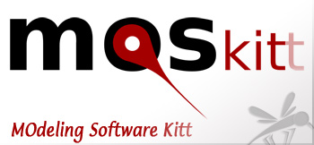

[MOSkitt](http://www.moskitt.org) (Modelling Open Source toolKITt MOdeling Software Kitt) is an [RCP](http://www.eclipse.org/community/rcp.php) application promoted by the same administration of [gvSIG](http://gvsig.org), the Transport Department of the Valencian Government, and developed by the company I work for, [Prodevelop](http://prodevelop.es). This project is used by software engineers to model their software applications and data bases using UML as well as other modelling languages like Entity Relationship and Work Breakdown Structure.

Today the [Eclipse/MOSKITT day](http://www.moskitt.org/moskittday-eclipseday/) will join here at Valencia a bunch of experts talking about models, metamodels, model transformations and model driven development, with even more acronyms than an OGC meeting.

Sadly, the preparation of the gvSIG conf (starting tomorrow) will leave me stuck at the headquarters, but my colleagues are very cool and will place all the slides under the same [slideshare event page](http://www.slideshare.net/event/moskittdayeclipseday-09).
