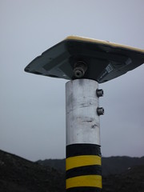

Pego la descripción de una [nueva lista de correo](http://groups.google.es/group/ing_geocarto) para que los Ingenieros en Geodesia y Cartografía (de España) puedan discutir y compartir experiencias sobre la titulación, el futuro de la misma, etc.

El foro está abierto de forma que cualquier persona puede suscribirse y ver qué se discute allí, acaba de empezar pero creo que puede ser un buen lugar en el que hablar de muchos de los temas e incertidumbres alrededor de esta titulación, tan poco conocida por la sociedad en general.

[http://groups.google.es/group/ing\_geocarto](http://groups.google.es/group/ing_geocarto)

> Bienvenidos y bienvenidas a este foro de Ingenieros en Geodesia y Cartografía.
> 
> Con el objetivo de crear un canal de comunicación entre todos los IGC de España, surge este Grupo Google. Independiente de que seas de un lugar u otro, estés vincualado o no a la Universidad, pertenezcas a la AIGC, estés colegiado en el COITTOP, te hayas unido a grupo de compañeros de carrera en algún tipo de comunidad, o andes solo buscando donde compartir tus comentarios con otros IGCs., éste puede ser un buen sitio donde encontrarnos.
> 
> Un sitio donde compartir inquietudes, aportar conocimientos, ver como están otros compañeros de profesión, y sentirnos arropados.
> 
> Con la ilusión de que este espacio sea útil, y nos podamos acercar más unos a los otros, disfrutemos del grupo.
