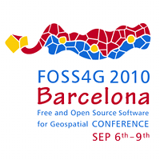

En lugar de acabar mañana, la fecha límite para el registro adelantado al [FOSS4G](http://2010.foss4g.org "Sitio web del FOSS4G") del año que viene se ha desplazado al 15 de enero. El registro adelantado supone una buena rebaja sobre el precio y un aliciente para los que tienen claro que el FOSS4G va a ser el evento de obligada asistencia para la comunidad geomática internacional.

Aún habrán dos períodos más de precios, obviamente encareciéndose conforme nos acerquemos a las fechas del evento, así que si necesitas alguna razón para convencer a tu jefe (o a tu pareja, o a tus padres, ...) para reservar cuanto antes tu plaza en este prometedor evento, nada mejor que ahorrarse unos euros.
