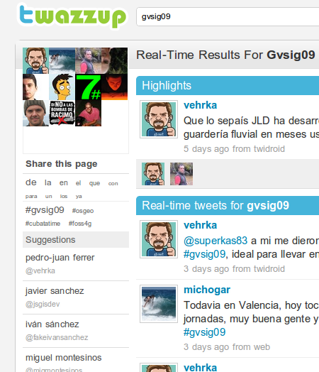

Creo que la mejor forma de contar cómo han ido las [jornadas gvSIG](http://jornadas.gvsig.org) es dejando al amable lector que lea las impresiones en vivo de algunos de los asistentes. Sirva de paso este artículo para recomendar seguir usando lo que se ha venido a conocer como el _[backchannel](http://en.wikipedia.org/wiki/Backchannel)_ como medio de comunicación informal y en directo alrededor de un congreso.

¿Cómo funciona esto? Bien, algunos asistentes usamos un sistema de notificación muy conocido llamado [twitter](http://twitter.com). Esta cosa permite dejar algo parecido a notas de lo que a uno se le pasa por la cabeza y que otras personas que te siguen lo vean en tiempo casi real. Si a una nota cualquiera le añadimos una palabra especial, consensuada por el resto de asistentes, es posible agrupar todas las notas alrededor del evento. En el caso de las jornadas la palabra clave, o _hashtag,_ era **#gvsig09** (la almohadilla le dice al sistema que esa palabra es una etiqueta especial).

Existen muchas webs que muestran en tiempo real las notas (_twitts_) de un tema en concreto, a mí me gusta [twazzup](http://www.twazzup.com/), pero hay muchas más. En definitiva, y por no alargar esto mucho más, recomiendo echar un vistazo de abajo a arriba a [las notas de las jornadas](http://www.twazzup.com/?q=gvsig09&l=all) para ver un poco de todo: lo bueno, lo malo, los chistes, los enlaces, etc. Como las notas se muestran en sentido cronológico inverso, hay que irse al fondo y darle al botón _previos resultados_ hasta que paren de salir notas, entonces habrás llegado a los primeros _twitts_ alrededor del congreso.

Los contribuidores a dicho _backchannel_, y por tanto verdaderos cronistas informales de las jornadas, han sido:

- Pedro Juan Ferrer: [@vehrka](http://twitter.com/vehrka)
- Javi Sánchez: [@jsgisdev](http://twitter.com/jsgisdev)
- Micho García: [@michogar](http://twitter.com/michogar)
- Iván Sánchez: [@RealIvanSanchez](http://twitter.com/RealIvanSanchez) y su alter ego [@FakeIvanSanchez](http://twitter.com/FakeIvanSanchez)
- Pablo Sanxiao: [@psanxiao](http://twitter.com/psanxiao)
- Miguel Montesinos: [@migmontesinos](http://twitter.com/migmontesinos)
- Arnulf Christl: [@sevenspatial](http://twitter.com/sevenspatial)
- Francisco Puga: [@fpuga](http://twitter.com/fpuga)
- Diego Guidi: [@D\_Guidi](http://twitter.com/D_Guidi)
- y un servidor: [@xurxosanz](http://twitter.com/xurxosanz)
