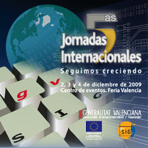

Por aquí el ritmo ya es bastante acelerado, ahora mismo es el [MOSKitt Day](http://geomaticblog.net/2009/12/01/good-moskitt-day/) y muchos compañeros ya han ido a Feria Valencia. Este año mi participación en las jornadas es bastante alta así que seguramente iré loco de un sitio a otro.

A saber...

- Miércoles: [reunión de OSGeo-ES](http://wiki.osgeo.org/wiki/Reuni%C3%B3n_OSGeo-ES_5as_Jornadas_gvSIG)
- Jueves: moderación de una mesa y asistir a la presentación de Christian sobre su proyecto en el Summer of Code
- Viernes: presento la participación de gvSIG y OSGeo en el Summer of Code con Luis Sevilla y luego más tarde con Vehrka el Capítulo Hispanohablante de OSGeo

El programa de las jornadas es apretado pero promete algunas presentaciones y talleres en mi opinión **muy interesantes**, como los talleres de desarrollo de gvSIG 2.0 y gvSIG mobile, las presentaciones de la gente del [CartoLab](http://cartolab.udc.es/), la de gvSIG y estándares, las que hacen mis compañeros de [Prodevelop](http://www.prodevelop.es), etc.

Todas las presentaciones se grabarán, así como el audio de la traducción en directo. Por lo tanto el congreso estará al completo disponible en la red dentro de unas semanas, tanto en español como en inglés, para los que no han podido venir... o los que estaremos pero no podremos asistir a todas las presentaciones que nos gustaría.

**¡Nos vemos!**
