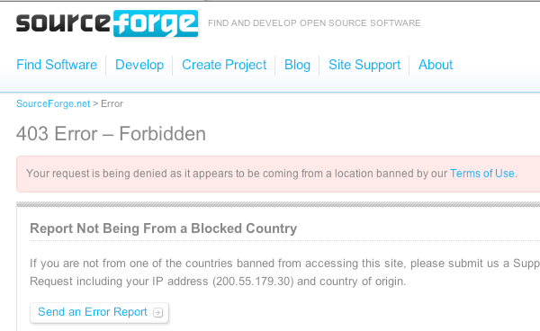

**Nota**: este artículo lo hemos escrito dos Jorges, un servidor y Jorge Batista (aka PB), compañero de armas de OSGeo-ES y como residente en Cuba desde que fue su madre lo trajo al mundo, sufridor de este sinsentido en el que vamos a ahondar a continuación.

vía [SourceForge.net: Blog](http://sourceforge.net/blog/clarifying-sourceforgenets-denial-of-site-access-for-certain-persons-in-accordance-with-us-law/):

> As one of the first companies to promote the adoption and distribution of free and open source software, and one that still puts open source at the center of its corporate ideals, restrictions on the free flow of information rub us the wrong way. However, in addition to participating in the open source community, we also live in the real world, and are governed by the laws of the country in which we are located. Our need to follow those laws supersedes any wishes we might have to make our community as inclusive as possible. The possible penalties for violating these restrictions include fines and imprisonment. Other hosting companies based in the US have similar legal and technical restrictions in place.

Esta situación también la sufren los usuarios de Google Code. Fue de hecho la principal razón para que SEXTANTE [se fuera de Google Code a OSOR.eu](http://listserv.gva.es/pipermail/gvsig_usuarios/2008-May/004954.html).

Así a bote pronto se me ocurren situaciones muy extrañas:

- Como alguien apunta en los comentarios, se da la situación de desarrolladores de los países embargados que **no podrán continuar con sus propios desarrollos** de software libre mientras dure esta restricción y los proyectos en los que trabajan sigan en sf.net
- Resulta cuando menos extraño que proyectos financiados o pagados por administraciones de fuera de EEUU **se vean afectadas por esta situación**. Por ejemplo, [GeoNetwork OpenSource](http://sourceforge.net/projects/geonetwork/) es un proyecto inicialmente apoyado por Naciones Unidas y me confirma mi compañero cubano PB que no puede ya ni descargarlo. Lo mismo ocurre con otros proyectos que usan esta infraestructura como [Geoserver](http://sourceforge.net/projects/geoserver/), [Geotools](http://sourceforge.net/projects/geotools/) y seguramente muchos más.

* * *

**XuRxO:** En realidad sf.net sólo está aplicando la ley del país en el que residen, como bien dicen en su blog, y lo que me preocupa es si otros servicios van a entrar en esta dinámica de cumplir la ley y van a restringir más aún el acceso a las personas que no tienen ninguna culpa de vivir en un país _enemigo_ (sic).

Como miembro de OSGeo.org, me preocupa esta situación. No podemos mirar para otro lado pensando en que mientras nadie nos diga nada, mejor estar calladitos y no remover más _el merder_, como decimos en mi tierra. Vale que no es cuestión de pegar la espantada, ni se catastrofistas o volvernos todos locos, pero tampoco es de recibo ser ajenos a esta situación y que luego nos pille el toro.

* * *

**PB**: A mi, por la simple razón de vivir en Cuba, la medida me afecta directamente. Los de sf.net dicen que “lo sienten profundamente” pero que mientras mi gobierno siga mereciéndose formar parte de la tan llevada y traída “lista negra” y mientras las leyes de los EEUU no cambien, las cosas van a seguir como están. Lo cierto es que, sin entrar en cuestionamientos jurídicos, estamos obligados a prescindir de los servicios de SourceForge. Es una verdadera pena que las libertades del sotware estén condicionadas, en nuestro caso, a viejas rencillas que vienen desde ¡mediados del siglo pasado!. Y peor aún, que otras personas como pueden ser los desarrolladores de los proyectos hospedados en sf.net; también tengan que sufrir las consecuencias.

De momento SourceForge es uno más que se alinea en “el otro bando”, sus razones tendrá. El software es hoy menos libre, eso sí, en nombre de la libertad; y los cubanos seguimos padeciendo restricciones y medidas originadas por diferencias políticas. ¿Qué nos queda? Pues buscar alternativas y seguir pa'lante. Ah y no quedarnos callaos, que sepan que tienen un enemigo digno.

* * *

Con este artículo queremos simplemente destacar la situación, en un ambiente sereno pero responsable, y ojalá con un consiguiente debate aquí o en las listas de correo donde nos podéis encontrar, vosotros ya sabéis dónde ;-)

Un saludo.

PB y XuRxO
