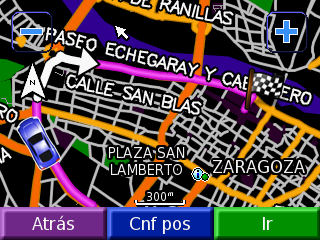

Con ese título: _[Mapas OSM-Garmin: trunk is red](http://lists.openstreetmap.org/pipermail/talk-es/2010-January/004320.html)_,  Carlos Dávila ha posteado hace un par de horas en la lista Talk-ES de [OSM](http://osm.org) un correo comentando sus avances en la generación de archivos de navegación para dispositivos Garmin.

Yo soy un feliz usuario de un Garmin Legend HCx y gracias al trabajo de Carlos a partir de ahora la cartografía que llevo en mi dispositivo (siempre he usado datos de OSM) se va a ver un poquito mejor y además me va a permitir hacer navegación _puerta a puerta_, aunque no era el principal uso que le quería dar al aparato.

Ahí va el enlace con información sobre OSM y los mapas: [Mapas gratuitos de OpenStreetMap para Garmin](http://mapas.alternativaslibres.es/)

Quería poner alguna imagen con los datos pero como no le voy a hacer una foto a la pantalla del GPS, mejor pego una de las capturas de pantalla que ha hecho Carlos;

