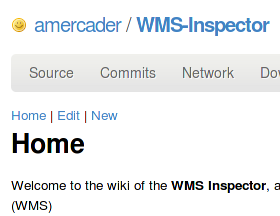

Me permito difundir [el mensaje](http://lists.osgeo.org/pipermail/spanish/2010-March/003111.html) que Adriâ Mercader ha enviado esta mañana a la lista [OSGeo Spanish](http://lists.osgeo.org/mailman/listinfo/spanish) (y supongo algunas más)

> Este es un mensaje para anunciar la primera versió pública de WMS Inspector, un complemento para Firefox de código abierto con herramientas para trabajar con Web Map Services (WMS). Puede resultar especialmente útil si se trabaja con librerias Javascript como OpenLayers o MapBender o se configuran servicios WMS
> 
> Sus características principales incluyen:
> 
> - Cargar todas las solicitudes WMS de la página actual y sus parámetros
> - Ordenar las solicitudes por servicio o tipo
> - Visualización de solicitudes (imágenes o errores) individuales
> - Copiar servicios, solicitudes o parámetros al portapapeles
> - Edición directa de los parámetros de las solicitudes
> - Salida de la respuesta GetCapabilities en forma de informe HTML o del archivo original
> 
> WMS Inspector se puede descargar del repositorio oficial de Mozilla: [https://addons.mozilla.org/firefox/addon/91406](https://addons.mozilla.org/firefox/addon/91406)
> 
> Para más información, por favor visitad [http://wiki.github.com/amercader/WMS-Inspector/](http://wiki.github.com/amercader/WMS-Inspector/)
> 
> Si queréis contribuir como desarrollador, tester o traductor o solo dar vuestra opinión, no dudéis en subscribiros o enviar un mensaje a la lista de discusión: [wmsinspector at freelists.org](http://www.freelists.org/list/wmsinspector)
> 
> Gracias, Adrià Mercader

¡¡Enhorabuena Adrià por contribuir este trabajo!!

Ahora la verdad es que no tengo mucho tiempo para probarlo, pero en cuanto me tenga que pelear con algo de _webmapping_ seguro que le echaré un vistazo, y si hay algo de interés que contar por aquí ya os lo hago saber....
