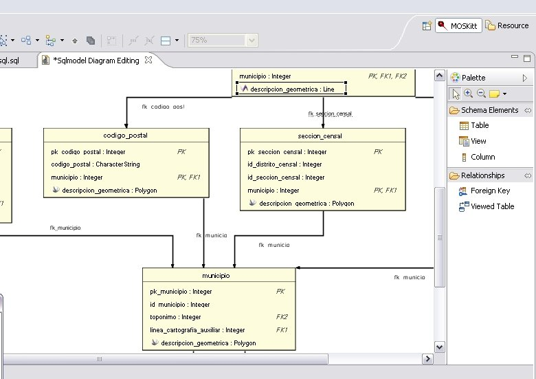

Probably some of you do a real engineering process to build your GIS projects, I mean, the classical _analyse-design-implement_ cycle. As a GIS is in fact an Information System with the (complex of course) spatial component, one should expect that the common tools and methodologies of «_normal Information Systems_» are available for GIS engineers but on the case of database modelling that's not so common.

So, what happens when you want to design a GIS data model? Well, one usually had to use a "fake" geometry type on your CASE tool of choice and afterwards create the geometry columns by hand or using custom post-processes.

Until now, because my smart colleagues at [Prodevelop](http://www.prodevelop.es) have developed an extension to the [MOSKitt](http://www.moskitt.org/) software called [MOSKitt Geo](http://www.prodevelop.es/en/products/MOSKitt/MOSKittGeo) that adds the spatial data type to the UML and Entity-Relationship models so you can perform the regular design process on MOSKitt: you do your UML model, then you convert it to the Entity-Relationship model and then you select your target database and MOSKitt creates the DDL scripts automatically.

Even more, you can also do reverse engineering of your spatial database and redesign or improve you data models using excellent MOSKitt graphical tools!

Take a look on these videos from the new [Prodevelop YouTube channel](http://www.youtube.com/user/prodeveloptv) to see how it works and go (**and comment!**) to the [Carlos post about MOSKitt Geo](http://www.prodevelop.es/en/blog/10/07/07/moskitt-geo-modelling-spatial-databases) at Prodevelop [blog](http://www.prodevelop.es/blog).

\[youtube=http://www.youtube.com/watch?v=motlsfzFXn0\]

\[youtube=http://www.youtube.com/watch?v=ed-Sb66llXY\]
