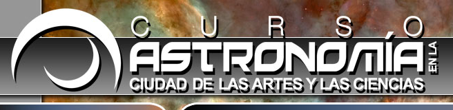

El año pasado [Aida](http://twitter.com/aidaivars) y yo nos quedamos con las ganas, pero este año hemos estado más atentos y en cuanto se abrió la inscripción nos apuntamos. Se trata del [curso de astronomía](http://www.cac.es/cursoastronomia10/) organizado por la [Ciudad de las Artes y las Ciencias de Valencia](http://www.cac.es/). Es un curso impartido por diferentes expertos de universidades, institutos de investigación y asociaciones en el que en cada sesión se irán tratando temas concretos como la vía láctea, los agujeros negros, etc. Este pasado jueves fue la primera sesión del curso, impartida en el [Hemisfèric](http://www.cac.es/hemisferic/) (perfecto planetario) donde pudimos ver de forma realmente impresionante cómo se producen los eclipses de sol y luna así como otros temas relacionados. Por cierto que coincidí en el curso con un compañero de [Prodevelop](http://www.prodevelop.es) ¡sin ninguno saber que iba el otro!

No veo nada de astronomía desde que hice la asignatura en segundo de carrera, donde realmente lo que vimos fue mecánica celeste más que nada. Este curso nos sirve pues para, quien sabe, tal vez arrancar un nuevo hobby. Un tío de Aida es un buen aficionado, y tiene la suerte de vivir en un sitio el que desde su propio jardín se pueden hacer observaciones, es toda una envidia para los que vivimos con tanta contaminación lumínica. El viernes que viene iremos a [Casinos](http://maps.google.es/maps?f=d&source=s_d&saddr=Valencia&daddr=39.717885,-0.726988&hl=es&geocode=FZ9EWgIdG0D6_ylT3JXQsEhgDTEy3khdIy6vZA;Ff0LXgIdNOj0_w&mra=ls&sll=39.717809,-0.726943&sspn=0.003631,0.006899&ie=UTF8&t=h&z=10) a observar (si el tiempo lo permite).

Por otro lado además del curso, la CAC lleva todo un [programa de conferencias](http://www.cac.es/astronomia10/presentacion.jsp?lang=es_ES) sobre Astronomía, son gratuitas y lo único que hay que hacer es inscribirse con antelación. El lunes que viene vamos a conocer [el telescopio espacial «Herschel»](http://www.cac.es/astronomia10/actividad01.jsp?lang=es_ES) y con un poco de suerte observar Júpiter, a ver qué sale.
