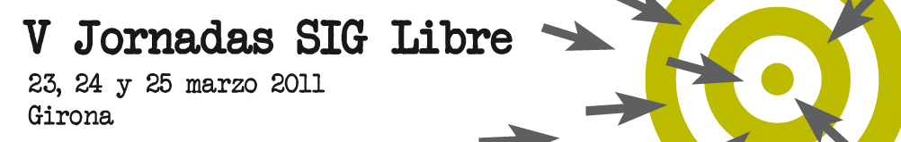

 Después de mucho esfuerzo, tenemos por fin disponible una primera versión del libro libre sobre SIG, un proyecto que comenzó a gestarse en la primera edición de estas Jornadas y que busca crear un texto de referencia libre sobre SIG escrito en castellano. Se trata de un proyecto abierto y libre, y por ello queremos aprovechar la labor de la comunidad para mejorar la calidad del texto. **Por esta razón, este año en las [Jornadas de SIG libre de Girona](http://www.sigte.udg.edu/jornadassiglibre/) llevaremos a cabo un pequeño evento de trabajo en el que intentaremos corregir y pulir el documento antes de sacar una versión definitiva, que será publicada en papel y distribuida de diversas formas**.

Nos gustaría contar con tu ayuda y tu experiencia para que este evento sea lo más productivo posible. Creemos que el objetivo que perseguimos es de gran interés para la comunidad, y tu colaboración es importante para lograrlo. Si estás interesado, nos reuniremos los **días 24 de Marzo a las 19.00h y 25 de Marzo a las 15.00h** en la misma [sede de las Jornadas de SIG Libre](http://www.sigte.udg.edu/jornadassiglibre/sede). Simplemente trae tu ordenador portátil y trabajaremos juntos en un ambiente relajado, compartiendo ideas acerca del libro que nos ayuden a mejorarlo y revisando los contenidos (texto, gráficos, etc.) que ya están desarrollados. En breve daremos instrucciones más detalladas acerca de cómo poder colaborar al inicio del evento. Próximamente publicaremos el programa científico de las Jornadas en el cual se informará de la sala dónde se llevarán a cabo las reuniones de trabajo.

Queremos agradecer la labor de todos aquellos que acudáis a esta cita. Por ello, los asistentes recibirán una **inscripción gratuita** a dos cursos on-line cursos de 20h de duración retransmitidos vía web) a celebrar durante el mes de mayo, uno de ellos sobre análisis avanzado con [SEXTANTE](http://forge.osor.eu/plugins/wiki/index.php?id=13&type=g), y otro sobre programación de algoritmos en [SEXTANTE](http://forge.osor.eu/plugins/wiki/index.php?id=13&type=g). De esta forma queremos valorar vuestra colaboración y animar a la comunidad a tomar parte en esta actividad.

Podéis consultar la [página web del libro](http://wiki.osgeo.org/wiki/Libro_SIG) para más información. Al inicio de las jornadas daremos más información y presentaremos esta iniciativa a todos los asistentes.

Saludos cordiales.
