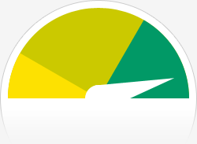

> Es la primera vez que [wordpress.com](http://www.wordpress.com) nos envía esta información de cómo ha ido el año en el blog y creo que vale la pena compartirla, para que se vea qué ritmo de publicación llevamos, cuántas visitas tenemos al blog (sin contar los planets, claro) y de dónde viene la gente que nos visita (especial mención para [La Cartoteca](http://alpoma.net/carto/), por cierto).
> 
> Resulta curioso que las entradas con más visitas sean de años anteriores, eso significa que llevamos una racha de «_poca interesantez»_, a ver si este año conseguimos escribir sobre temas más candentes e interesantes para nuestros lectores.
> 
> ¡¡¡Feliz Año!!!

 

Los duendes de estadísticas de WordPress.com han analizado el desempeño de este blog en 2010 y te presentan un resumen de alto nivel de la salud de tu blog:

El _Blog-Health-o-Meter™_ indica: Wow.

## Números crujientes

Un barco de contenedores puede llevar a unos 4.500 contenedores. Este blog fue visto cerca de **20,000** veces en 2010. Si cada cada visita fuera un contenedor, tu blog llenaría 4 barcos.

En 2010, publicaste **22** entradas nueva, haciendo crecer el archivo para 156 entradas. Subiste **15** imágenes, ocupando un total de 772kb. Eso es alrededor de una imagen por mes.

Tu día más ocupado del año fue el 10 de marzo con **169** visitas. La entrada más popular de ese día fue [WMS Inspector](http://geomaticblog.net/2010/03/10/wms-inspector/).

## ¿De dónde vienen?

Los sitios de referencia más populares en 2010 fueran **geocomuna.wordpress.com**, **osgeo.org**, **search.conduit.com**, **alpoma.net** y **google.es**.

Algunos visitantes buscan tu blog, sobre todo por **valencia**, **geomatic blog**, **google maps para iphone**, **geomaticblog** y **geoide**.

## Lugares de interés en 2010

Estas son las entradas y páginas con más visitas en 2010.

1

[WMS Inspector](http://geomaticblog.net/2010/03/10/wms-inspector/) marzo, 2010 1 comentario

2

[TileCache en Windows](http://geomaticblog.net/2008/01/24/2008-01-24-tilecache_windows/) enero, 2008 10 comentarios

3

[Manejando información SRTM con GDAL](http://geomaticblog.net/2009/04/15/manejando-srtm-con-gdal/) abril, 2009

4

[De OGRs y Rejillas NTv2](http://geomaticblog.net/2009/01/23/2009-01-23-ogrs_y_rejillas_ntv2/) enero, 2009 3 comentarios

5

[Valencia 1704](http://geomaticblog.net/2009/09/28/valencia-1704/) septiembre, 2009
