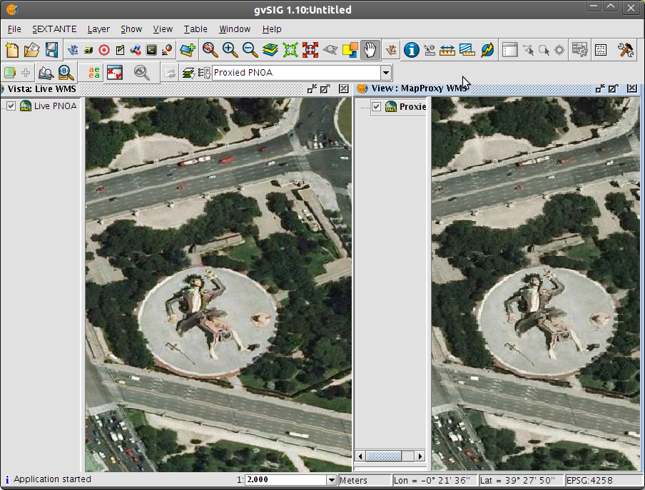

Durante bastante tiempo hemos tenido a [TileCache](http://tilecache.org) como «el producto» (libre por supuesto) a usar cuando queríamos montar un servidor de teselas que acelerara nuestros clientes web, usando [TMS](http://wiki.osgeo.org/wiki/Tile_Map_Service_Specification) o [WMS-C](http://wiki.osgeo.org/wiki/WMS_Tiling_Client_Recommendation) como protocolos de acceso. Desde hace un tiempo [GeoWebCache](http://geowebcache.org "GeoWebCache") ha ido tomando forma, lo que empezó como una beca para un [Google Summer of Code](http://google-opensource.blogspot.com/2008/05/accelerate-your-maps-with-geowebcache.html) se ha ido convirtiendo en un producto funcional. Pero desde hace tiempo ha llegado un nuevo chico al barrio, se llama **[MapProxy](http://mapproxy.org)** y tiene algunas características bastante interesantes.

MapProxy tecnológicamente hablando es un desarrollo escrito en Python, que permite desplegarse en lo que se llama un "entorno virtual" que permite aislar tu entorno de desarrollo del resto de tu sistema. Igualmente trae un sencillo servidor web para desarrollo y para usarlo en producción debemos acudir a FastCGI o bien a [WSGI](http://wsgi.org/wsgi/What_is_WSGI), un estándar Python para desplegar aplicaciones web. El despliegue por tanto es más o menos similar al de TileCache.

**[MapProxy](http://mapproxy.org)** no sólo se expone como un servidor TMS o WMS-C, también y esta es su mayor diferencia, se expone como un **servidor WMS normal**. Es decir, a partir de los orígenes que definamos y que se irán almacenando cacheados en disco, además de como servicios de teselas MapProxy también podrá atender a peticiones que caigan fuera de los límites de dicha cuadrícula. Para ello compondrá y reproyectará si fuera necesario la imagen al tamaño y sistema de referencia requerido.

Esto abre escenarios muy interesantes, por ejemplo usar nuestras _caches_ con clientes pesados como [gvSIG](http://www.gvsig.org) y no sólo tirando de servicios WMS existentes sino también de otros que únicamente fueran servidos mediante TMS. Es decir, por decirlo de forma sencilla, podemos montar un WMS de [OpenStreetMap](http://www.osm.org). Claro que un origen como OSM no se verá muy bien en las zonas intermedias entre resoluciones de la caché porque las etiquetas y elementos lineales se distorsionarán bastante. Pongo un pequeño ejemplo a una escala bastante grande, de cómo se vería OSM en gvSIG.

Más usos: cachear OSM u otros orígenes muy frecuentados en nuestra organización (como por ejemplo el PNOA), permitiendo a nuestros técnicos no sólo consumir estos datos desde clientes ligeros de visores corporativos sino también desde clientes pesados claro. Podríamos limitar esas _caches_ tanto en su extensión geográfica, como en su duración temporal así como en su espacio ocupado en disco porque  MapProxy también añade bastante «azúcar» en la parte de la generación y mantenimiento de sus _caches_, pero esto lo dejaré para otro día.

Desgraciadamente MapProxy aún no soporta el estándar [WMTS](http://www.opengeospatial.org/standards/wmts) aunque diría que esto se resolverá en poco tiempo y hace otras cosas interesantes como redirigir las peticiones _getFeatureInfo_ y _getLegendGraphic_ a las capas originales, cosa que TileCache (si no me equivoco) tampoco hace.

Instalar MapProxy en una distribución GNU/Linux moderna es bastante sencillo, la [documentación](http://mapproxy.org/docs/nightly/index.html) es muy buena (usan mi querido [sphinx](http://sphinx.pocoo.org/)) y su [lista de correo](http://www.osgeo.org/mailman/listinfo/mapproxy) es bastante activa como para ir salvando cualquier escollo que vayamos encontrando.

En este [enlace a pastebin](http://pastebin.com/L3whrJDk) dejo una configuración básica bastante autoexplicativa en la que se sirven dos capas, la de OSM de la figura anterior y también el WMS-C del PNOA. Me hubiera gustado conectar al PNOA mediante el protocolo TMS pero no ha habido manera, al final he usado una capa WMS, teniendo que eliminar los _metatiles_ porque MapProxy los usa por defecto en capas WMS. En cualquier caso el ejemplo funciona a la perfección.

A continuación dejo un pantallazo de gvSIG mostrando en dos vistas el PNOA en vivo y el cacheado, se puede ver que no hay diferencia apreciable entre ambos. Lo que se ve por cierto es el [Gulliver](http://www.google.es/images?q=gulliver+valencia&um=1&ie=UTF-8&source=univ&sa=X&ei=kG9-Tc-lCoK6hAfuiqnhBg&ved=0CEMQsAQ&biw=1366&bih=679) de [Valencia](http://www.openstreetmap.org/?lat=39.462215&lon=-0.359902&zoom=18&layers=M), un parque _rompepantalones_ muy popular.

Como conclusión a este ¿primer? artículo sobre [MapProxy](http://mapproxy.org) simplemente recomendar su evaluación si se tiene que desplegar un servidor de teselas nuevos y el entorno tecnológico es el adecuado. Servir WMS a partir de _caches_ añade una funcionalidad que en determinados escenarios puede ser más que interesante.
