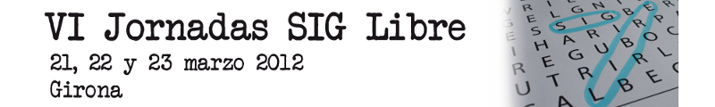

Siempre supone un motivo de ALEGRÍA -así, en mayúsculas- lanzar el anuncio de la celebración de las Jornadas de SIG Libre de Girona. Y resulta un motivo de alegría y de felicidad por dos motivos básicos el primero de los cuales, es porqué se trata de un evento, el de las jornadas de SIG Libre, que nos apetece organizar, un proyecto al que queremos sin condición alguna. En segundo lugar, porqué significa que continuamos en la brecha, muy a pesar de la crisis que amenaza y atenaza al sector en los últimos tiempos. Así que es natural que nos sintamos doblemente orgullosos de las jornadas de Girona que, como ya viene siendo costumbre, continúan ejerciendo su función de escaparate y de altavoz de las soluciones libres para SIG.

Como en cada nueva edición, os presentamos un programa de ponencias plenarias que esperamos sinceramente que os resulten de interés. Las charlas plenarias de las Jornadas, intentan abarcar temas y aspectos que si bien, en ocasiones no son meramente geográficos, sí pueden conectar con la naturaleza de los SIG y de los datos geográficos de un modo u otro. Se trata de ampliar puntos de vista, de desplazar ligeramente el foco sobre temas que van más allá de los SIG, que son tangenciales o extrapolables a nuestro sector o campo de aplicación, con el ánimo de ampliar el abanico de visiones acerca de todo aquello que sea libre.

Así pues, es tiempo de reencontrarse, de compartir y de continuar aprendiendo, de reconocer viejos gestos y caras conocidas, y descubrir nuevas experiencias, proyectos, y oportunidades de colaboración y de negocio. Y es que las Jornadas, en esencia, son esto, un escenario en el cual mostrar el "cómo" y compartir el "qué". Son tiempos complicados, y es tiempo para la innovación y la inversión en las soluciones libres, tiempo para realizar la apuesta definitiva.

Un año más, una edición más, os emplazamos a que visitéis Girona y que participéis de forma activa en la mejora constante de este evento. Estáis en casa, y os esperamos:

**[www.sigte.udg.edu/jornadassiglibre](www.sigte.udg.edu/jornadassiglibre "VI Jornadas de SIG Libre")**

Comité Organizador Local.
