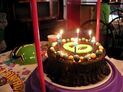

Today this blog is six years old. That's a lot of time and it deserves at least a small post to remind you this blog is [still alive](https://www.youtube.com/watch?v=Y6ljFaKRTrI) even if we don't post a lot. [Vicente](http://twitter.com/geochente) is busy with [his company](http://www.gim-geomatics.com/), [Pedro](http://twitter.com/vehrka) is busy with his recent fatherhood (his baby was born **yesterday**!!) and me, well I'm busy with my stuff ^\_^. But we are lucky at geomatic blog because we have **a lot of friends** and from time to time we convince someone to join the family and post about what they love as [Roberto](http://twitter.com/tolanss) our astronomer did recently about the [summers solstice](/2012/06/21/el-solsticio-de-verano/).

We will try to keep posting as we have time, energy and interesting stuff to share. In the meantime, [follow us on twitter](http://twitter.com/geomaticblog) (we post interesting links from time to time there) and of course, if you are close to us and don't have or want your own blog, **you are invited to join the team** and consider geomatic blog as your **home** for your geogeekery.

Congratulations to all the team!!
