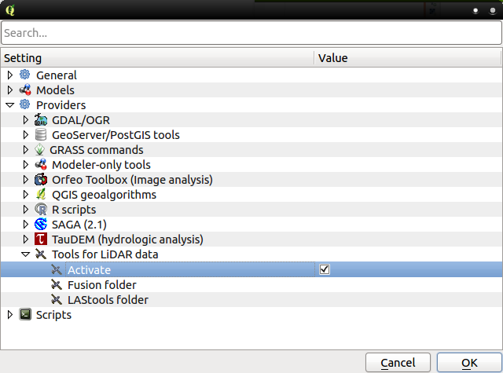

El conjunto de herramientas [LAStools](https://twitter.com/lastools) para procesar datos LiDAR están disponibles en el software propiertario ArcGIS desde abril de 2012, pero no ha sido hasta el [FOSS4G13](http://2013.foss4g.org/) de Nottingham que no han estado disponibles para [QGIS](http://www.qgis.org/). Las herramientas han sido testadas en QGIS 1.8.0-Lisboa y 2.0.1-Dufour. En esta entrada os enseñamos el modo de installar LAStools en QGIS y, básicamente, es la traducción y adaptación del [manual de instalación](http://rapidlasso.com/2013/09/29/how-to-install-lastools-toolbox-in-qgis/) que se encuentra en el blog de Martin Isenburg _aka_ [rapidlasso](https://twitter.com/rapidlasso).

Nos centraremos en instalar las herramientas en la versión de QGIS [2.0.1-Dufour](http://www.qgis.org/es/site/forusers/download.html), por lo que lo primero que necesitamos es descargar e installar dicha versión. A partir de entonces, seguiremos las siguientes instrucciones:

1. Si tienes abierto QGIS, ciérralo
    
2. Borra la carpeta donde está contenido el plugin de LiDAR en sextante. La ruta para los usuarios de Windows es:
    
    "C:\\Program Files\\QGIS Dufour\\apps\\qgis\\python\\plugins\\processing\\lidar"
    
    La ruta para los usuarios de GNU/Linux es
    
    ~/.qgis/python/plugins/processing/lidar
    
3. Copia la carpeta _lidar_ que está en [este archivo](http://lastools.org/download/QGIS_2_0_toolbox.zip) comprimido en el lugar de la carpeta borrada.
    
    **Nota:** Los usuarios de QGIS 1.8.0-Lisboa tienen que sustituir la carpeta _lidar_ dentro de:
    
    "C:\\Program Files\\QGIS Dufour\\apps\\qgis\\python\\plugins\\sextante\\lidar"
    
    o si utilizas GNU/Linux, dentro de:
    
    ~/.qgis/python/plugins/sextante/lidar
    
    por la que se encuentra en [este otro archivo](http://lastools.org/download/QGIS_1_8_toolbox.zip) comprimido.
4. Descarga la versión más reciente de las LAStools que se encuentra en [lastools.zip](http://lastools.org/download/lastools.zip).
    
5. Extrae la carpeta _lastools_. Si estás usando Windows, procura no estraerlo en ninguna ruta con espacios, si estás en GNU/Linux tendrás que compilar las herramientas.
    
6. Inicia QGIS, y si encuentras algún error cuando se carge el _script_ de Python, repite los pasos de 1 a 3 con más cuidado ;)
    
7. Habilita el _toolbox_ que se encuentra bajo el menú _procesing_ como se muestra en la siguiente figura:
    
    
8. Cambia el _toolbox_ de _Simplified Interface_ a _Advanced Interface_, imágenes de la izquierda y derecha respectivamente:
    
       
9. Abre el submenú _Options and configurations_ de la pestaña _Processing_ como se muestra a continuación:
    
    
10. Activa la casilla _Activate_ que se encuentra en _Providers -> Tools for LiDAR data_ como se muestra en la siguiente figura, e introduce la ruta de la carpeta donde estén alojadas las LAStools en _LAStools folder_:
    
    
11. Ahora deberías ver el conjunto de herramientas _Tools for LiDAR data_ en el _toolbox_ y todas las LAStools como en esta figura:
    
    
12. Inicia cualquier comando mediante un doble click y rellena las opciones. En la siguiente figura se muestra la interfaz de **lasinfo**.
    
    

Tened en cuenta que, al distrubuirse el código de manera libre sólo de unas pocas herramientas, los usuarios de GNU/Linux tendrán menos funcionalidades disponibles. No así los usuarios de Windows, cuyas herramientas se distribuyen como [shareware](http://es.wikipedia.org/wiki/Shareware).

Martin Isenburg agradece a Victor Olaya por crear todo el entorno de sextante para crear nuevos _plugins_ y por los ejemplos de cómo crear módulos. Al igual que él, yo también agradezo a Victor todo el trabajo porque también estoy trasteando con la creación de módulos dentro de sextante :P
