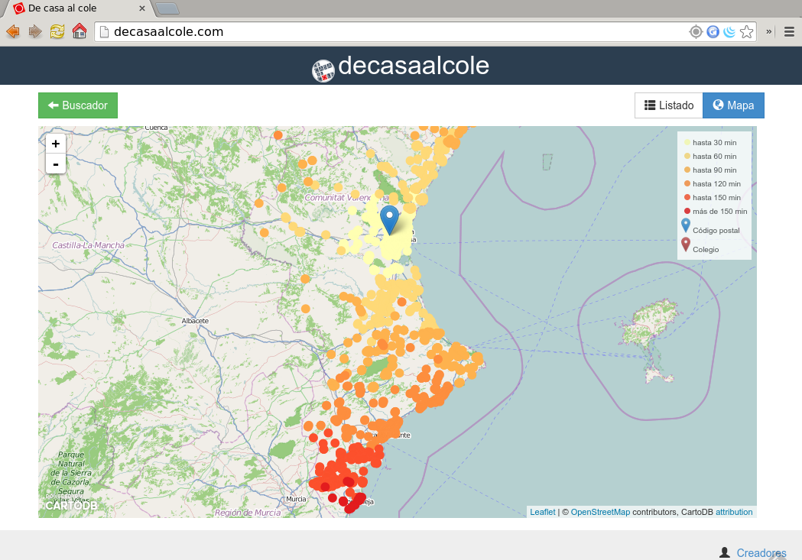

We've been pretty quiet over the last year but that doesn't mean we've been unoccupied. Last summer we ([Pedro](http://twitter.com/vehrka) and me) participated with [some friends](https://www.flickr.com/photos/xurxosanz/14983072199/in/set-72157647265852868) on a [hackathon](http://www.meetup.com/Hackathon-Lovers/events/196595462/) with a project to give to teachers from our region a tool to help them to relocate, precalculating travelling times with [OSRM](http://project-osrm.org/) and some open datasets, one of them a database of schools that our government [published](http://www.cece.gva.es/ocd/areacd/es/descargas.htm) as a spreadsheet. That gave us the chance to work and improve our knowledge on the [CartoDB](http://cartodb.com/) Platform, we used their [JavaScript API](http://docs.cartodb.com/cartodb-platform/cartodb-js.html) to place a Leaflet map with a parametrized map where the SQL that defined the layer changed depending on user selections. The project is [online](http://decasaalcole.com/) with some [slides](http://decasaalcole.github.io/talks/makingof/#/4/5) with further information, all in Spanish.

 De Casa al Cole Map

After that experience, and thanks to Pedro’s friendship with [Carlos Galcerán](https://twitter.com/antipodasnz), a Cuban GIS consultant working in New Zealand, we had the opportunity to put our brains working again for another pet project. The idea is easy, have you ever wondered who is on your antipodes? Yes, three quarters of our planet are oceans so the chance to have an inhabited antipodes is not high but here in Spain, it happens that half of the Iberian Peninsula is antipodal to New Zealand. Join that with the possibility to have data about schools on both countries and well, that’s reason enough for us to start playing. Imagine a geography class on primary school, say in the north coast of Galicia, where kids can contact their antipodal school in Christchurch and practice their English, or kiwis practicing their Spanish, both learning about our cultures, favorite sports, our differences.

We started with a dataset only for [Galician schools](https://github.com/geoinquietosvlc/antipodes-map/blob/master/data/geojson/data_gal.geojson) and end up digging a [national registry](https://www.educacion.gob.es/centros/home.do) of schools to create a full dataset of schools for the country. That and the help of Carlos and some help from the Spanish Embassy in New Zealand, gave us all the data needed to set up [two tables on CartoDB](https://vehrka.cartodb.com/datasets), so the last piece was just a web interface to develop. With the recent release of [OpenLayers 3](http://openlayers.org/), and having played with it a bit [before](https://gist.github.com/jsanz/1ebcb326e6cd2ff2eac0), I wanted to do something more complex. We’ll leave the technical details about data and software for another post or two. The application is available at [http://antipodes.decasaalcole.com](http://antipodes.decasaalcole.com).

 Antipodes Map

If you like the idea and know someone in New Zealand or Spain that could be interested, please **spread the word**. And of course, the [data](https://vehrka.cartodb.com/datasets) is available for reuse on CartoDB and the [code](https://github.com/geoinquietosvlc/antipodes-map/tree/master/ol3) is also on GitHub, ready to be reused on other lucky antipodal combinations, we’d love to see both data and software **reused** and **improved**!!
