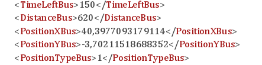
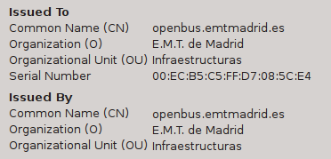

Today, february 21st 2015, is the [Open Data Day](http://opendataday.org/). And given that I'm far asay from my favourite Open Data nerds down at the [Medialab Prado](http://medialab-prado.es/?lang=en), I decided to work on giving the old [¿Cuánto Tarda Mi Autobús?](http://www.cuantotardamiautobus.es) website a facelift.

The story behind ¿Cuánto tarda mi autobús? is rather simple. A couple of years ago I got my first smartphone, and one of the things I wanted to do is check for the bus times in Madrid. Back then, [EMT Madrid](https://www.emtmadrid.es) (the public company which runs the buses) was heavily promoting its new website in the Spanish GIS scene. The major problem was that the website for checking the times was made with Flash (actually, with ESRI Flex) and simply there is no way to use that with a smartphone.

So I reverse-engineered the protocol (if you call "reading a WSDL document" reverse engineering), did a bit of PHP plus [Leaflet](http://www.leafletjs.org), and I was able to check the bus times with a web app.

* * *

 

Fast-forward to the present. EMT had released the API details under the banner of «[Open Data EMT](http://opendata.emtmadrid.es/Home.aspx?lang=en-GB)», I had a saturday to devote to the Open Data Day, and my little web app needed some love after two years of no updates at all.

But, oh boy, every time I try to develop anything with interfaces made by big subcontractors, I cannot stop cringing at the amount of WTF found around.

# The antipatterns

### Antipattern 1: «Open Data» which isn't actual Open Data.

In the same way that Open Source software can only be Open Source if it meets the [Open Source Definition](http://opensource.org/osd), Open Data is only Open Data if it meets the [Open Definition](http://opendefinition.org/od/). Period. These definitions are evolved versions of the [DFSG](https://en.wikipedia.org/wiki/Debian_Free_Software_Guidelines) and [Free Software Definition](https://en.wikipedia.org/wiki/The_Free_Software_Definition), curated with years of experience and discussions about what is open and what is not.

So, the Open Definition states:

> 2.1.8 Application to Any Purpose
> 
> The license **must** allow use, redistribution, modification, and compilation for any purpose. The license **must not** restrict anyone from making use of the work in a specific field of endeavor.

From «OpenData EMT»'s [terms and conditions](http://opendata.emtmadrid.es/Documentos/terminosycondiciones.aspx?lang=en-GB):

> 1\. The re-user agent is explicitly prohibited from distorting the nature of the information, and is obliged to: a. Not to manipulate nor falsify the information. b. Ensure that any information displayed in your system is always up to date. c. Not to use the information to undermine or damage EMT's public image. d. Not to use the information in sites that might lead to a relation with illegal acts or attempts to sabotage EMT or any other entity, organization or person.

So apparently I cannot:

- Display historical information (because my data must be up-to-date).
- Say that the system is a complete piece of steaming crap from a technological point of view.
- Use the information in sites such as Facebook or Twitter, because those sites _might_ be used for an attempted sabotage to «any entity or person». Who the fuck wrote this blanket clause, folks?

Please, don't call it «Open Data».

I have to give praise to the EMT, though. The previous version of the agreement obliged the reuser to not disclose that he/she signed an open data agreement. At least they fixed that.

### Antipattern 2: Your SOAP examples contain raw XML.

The whole point of SOAP was to abstract data access. And, still, every public SOAP interface I've ever seen includes examples with raw XML fragments that you're supposed to build up.

If you cannot write [code that access SOAP without writing XML](https://github.com/IvanSanchez/cuantotardamiautobus/blob/642d0d2f9b883befc5530e255ca1b269aedaf25d/src/madrid/linea.php#L31), you're doing it wrong.

Think about how WMS interfaces work nowadays: you just publish the WMS endpoint, and your GIS software takes care of the capabilities and the

### Antipattern 3: Keep default fake values in your production code.

From the docs:

Note «tempuri.org». A quick search will tell you that the system was designed using Visual Studio, and some lazy so-called software engineer didn't bother to change the defaults.

### Antipattern 4: Fuck up your coordinate systems

Note to non-spaniard readers: The city of Madrid is located roughly at latitude 40.38 north, longitude 3.71 west.

Now look at this example from the EMT docs about how bus coordinates are returned:

### Antipattern 5: Mix up your coordinate systems

Write things like "UTM" and "geodetic" in your documentation, but do not write which UTM strip you're referring to (hint: it's 30 north, and the SRS is EPSG:23030). Make some of your API methods to return coordinates in EPSG:23030 and some others to return coordinates in EPSG:4326.

And for extra fun, have your input coordinate fields accept both of those SRSs as strings with comma-defined decimal point, and then do this in the documentation:

### Antipattern 6: Self-signed SSL certificates

Srsly?

### Antipattern 7: Wrap everything up in HTTP + JSON and call it "REST"

[REST](https://en.wikipedia.org/wiki/Representational_state_transfer) is a beautiful technology because it builds up pretty much on top of raw HTTP. Every object ("resource") has its own URI ("universal resource identifier"), and the HTTP verbs are used semantically (GET actually gets information, POST modifies information, DELETE deletes a resource, and so on).

Also, [HTTP status codes](https://en.wikipedia.org/wiki/List_of_HTTP_status_codes) are used for the return status. An HTTP status code 200 means that the data is OK, a 404 means that the resource doesn't exist, a 401 means that you are not authorized to get/post/delete the resource. Reusing the semantics of HTTP is way cool.

So, in a REST interface for bus stops, the stop number 1234 (a resource) would be located at its URI, e.g. http://whatever/stops/1234. It's beautiful because the URI has a meaning, and the HTTP verb GET (which is the default when a web browser is fetching something) has a meaning. The server would answer with a "200 OK" and then the resource.

Low-level, it should look like:

GET /stops/1234 HTTP/1.1

-----

HTTP/1.1 200 OK
Content-Type: text/JSON

{
"stopId": 1234, 
"latitude": 40.3,
"longitude": -3.71,
"stopName": "Lorep Ipsum Street",
"lines": \["12", "34"\]
}

Now compare the theoretical RESTful way to fetch one bus stop with the real-life mess:

POST /emt-proxy-server/last/bus/GetNodesLines.php HTTP/1.1
idClient=user&passKey=12345678-1234-1234-12345678&Nodes=1234

-----

HTTP/1.1 200 OK
Content-Type: text/JSON

{
"resultCode":0,
"resultDescription":"Resultado de la operacion Correcta",
"resultValues":{
  "node":1234,
  "name":"ROBERTO DOMINGO-AV.DONOSTIARRA",
  "lines":\["21\\/1"\],
  "latitude":40.434861209797,
  "longitude":-3.6608600156554
  }
}

So, meaningless URI, POST request to fetch a resource, duplicated return status codes (for the HTTP layer and some other underlying layer).

Let me say this very, very clearly: **In REST, you do not wrap a resource in a call to get that resource**. Geez.

# My takeaway

Readers will do good to keep in mind that I'm using my spare time in order to participate in the Open Data Day, for fun. The problem is that working with such an arquitecture is no fun at all. I can deal with these kind of [enterprisey](https://en.wiktionary.org/wiki/enterprisey), [Dilbertesque](http://www.urbandictionary.com/define.php?term=Dilbertesque) software stacks in a day-to-day basis, but only if I'm getting paid to endure the cringing and teeth-grinding.

I think it's because the mind of an Open Source / Open Data nerd like me is difficult to understand by the classic propietary software people. I develop software just for the fun of doing so, just because I can, just **because I like the feeling of empowerment of creating my own tools**.

I write a lot of open source stuff. I fix wikipedia from time to time, I map stuff on OpenStreetMap if something's wrong. I like to do it, and I empower other people to build upon my work.

Building upon good Open Source/Data doesn't feel like standing on the shoulders of giants. It feels like standing on the soulders of a mountain of midgets... and if you're lucky, you'll be one of those midgets and someone will stand upon your shoulders.

For me, that involves a great deal of humility. When I watch the closed-source crowd talk about their latest product or software, they are congratulating themselves, but when I watch the open-source crowd, they're constantly critizising themselves. And I can critizise them and they can critizise me and we all learn and that's why they're awesome.

</rant>
