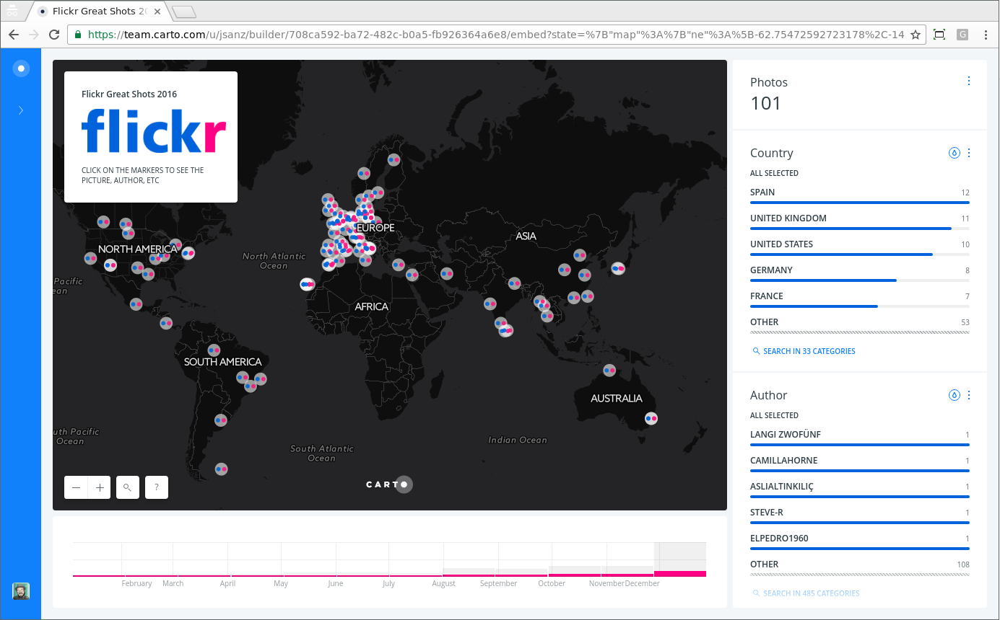

Phew, it's been almost two years since my last [techie blog post](https://geomaticblog.net/2015/01/13/about-antipodes-map/). I know I know, blame on me, I should've been writing more here but at least I did some nice posts at [CARTO blog](https://carto.com/blog/author/jorge-sanz). Anyway, It's Christmas today and because _Internet is my playground and any piece of data I can put on a map can be a toy_ I spent a few hours having some geeky fun.

A few days ago a friend asked I knew any service to create a map of pictures in a collaborative environment. I thought maybe a trendy photo service like Instagram would be a good fit but it happens it's [super restrictive for developers](https://www.instagram.com/developer/) so I headed to the good old [Flickr](http://flickr.com). Flickr is one of those services that are really _developer friendly_, has a _ton of super cool features_ and a _decent mobile application_ and still, for some reason, **it's loosing its traction**. Sad.

Anyway, Flickr has groups so a number of individuals can share geolocated pictures and they can display it on a map but sincerely, it has a very bad interface so probably we can do something better with [CARTO](http://carto.com). The issue then is _how can we maintain an updated map in CARTO from a Flickr Group_?

I'm a big fan of unmanaged services. I know there are people that love to maintain their servers but I'm not one of them. If I have to publish a website I try to use something static like uploading the site to [Amazon S3](https://aws.amazon.com/s3/) (i.e. my [own website](http://jorgesanz.net)) or even better, use [Github Pages](https://pages.github.com/) like the [Geoinquietos website](http://geoinquietos.org). In this case not so long ago the only option to build an application to solve this issue was going to a PaaS service like [Heroku,](https://www.heroku.com/) [Amazon Beanstalk](https://aws.amazon.com/elasticbeanstalk/) or [Google App Engine](https://cloud.google.com/appengine/), but they are meant for big applications typically involving a database and in general an architecture prepared for bigger things than this simple requirement. Over the last two years a new approach has emerged, a type of service that provides an automatically managed infrastructure to define small functions where each one is aimed to do a single functionality. They only live while they are being executed and afterwards the server is shut down. [Amazon Lambda](https://aws.amazon.com/lambda/) was the first of it's class but recently also appeared [Google Cloud Functions](https://cloud.google.com/functions/). On both services you can write your function in different languages (Python, Java, NodeJS, even PHP) and they can be triggered from a HTTP call or schedule its execution periodically.

As everything with Amazon, configuration from their website can be _difficult_ and using it from the command line can be _heroic_. But it was a matter of time that something like [Zappa](http://www.zappa.io) would appear. Zappa is an application that makes deploying Python functions to Lambda **dead easy**. You basically configure a few settings and code your function and it takes care of the full cycle of deploying, versioning and even you can tail the logs from the cloud into your console in real time.

So to make this as short as possible, I coded a Lambda function that is exposed as a url acting as a proxy to [Flickr API](https://www.flickr.com/services/api/). This proxy will take URL arguments (or use some defaults) to retrieve photos information and will output them as a valid GeoJSON file. This allows me to create a [CARTO Synchronized Table](https://carto.com/docs/carto-engine/import-api/sync-tables) that updates every hour for example and retrieves the last pictures sent to a group (up to 500, as a Flickr API limitation). This dataset can then be used to create a [BUILDER dashboard](https://team.carto.com/u/jsanz/builder/708ca592-ba72-482c-b0a5-fb926364a6e8/embed) to present the pictures as nicely as possible.

 Map for the last 500 pictures of the "[Your Best Shot of 2016](https://www.flickr.com/groups/yourbestshot2016)" group on Flickr

Additionally, on this map I kind of _reverse geocoded_ image locations using a world borders dataset so I was able to add a country widget. Apart from that and a bit of CartoCSS to reproduce Flickr logo, the dashboard is quite simple. If you click on any of the images the pop up highlights the image (I **love** this feature) and you can go and visit the picture page in Flickr.



But there are other methods on Flickr that returns photos, you can create a map of [an account public uploads](https://www.flickr.com/services/api/flickr.people.getPublicPhotos.html), or a map of the most [interesting photos](https://www.flickr.com/services/api/flickr.interestingness.getList.html) of the day, by [photoset](https://www.flickr.com/services/api/flickr.photosets.getPhotos.html), etc. etc. All using the same proxy!!

I've created a [github repo](https://github.com/jsanz/carto-lambda-examples) with the source code of [this proxy](https://github.com/jsanz/carto-lambda-examples/blob/master/flickr_to_geojson.py) (just around 130 lines of code) and more detailed instructions on how to set up your environment to deploy your own version of it on your account and use it in your own integrations. I have more ideas that I want to explore and I'll try to share it here when I do them.

- Leverage the [Foursquare real time API](https://developer.foursquare.com/overview/realtime) to create a dataset in CARTO that is automatically updated every time I do a check-in
- How to configure a scheduled task using the [CARTO Engine](https://carto.com/engine/) [SQL API](https://carto.com/docs/cartodb-platform/sql-api/). This is a **super common** use case when you develop projects with CARTO.
- Create a [CARTO Engine](https://carto.com/engine/) proxy to allow anonymous users to perform some tasks only accessible by default to authenticated users.

What do you think of this approach? Have you used Lambda for any other interesting use cases? Do you want me to continue posting on this topic about the other ideas I have? Feel free to comment here or reach me [on twitter](https://twitter.com/xurxosanz).
