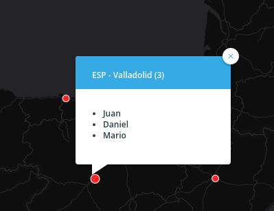

> NOTE: I'll use [CARTO](https://carto.com) but you can apply all this to any _webmapping_ technology backed by a modern database.

### Get all the data

So we start with the typical use case where we have a one to many relationship like this:

\[code language="sql"\] select e.cartodb\_id, e.displayname, e.division, e.photourl, l.cartodb\_id as locaction\_id, l.location, l.the\_geom\_webmercator from locations l inner join employees e on e.location = l.location order by location \[/code\]

Easy peasy, we have a map with many stacked points. From here you can jump to this excellent post by James Milner about [dense point maps](https://www.loxodrome.io/post/dense-spatial-data/). My example is not about having thousands of scattered points that at certain zoom levels overlap. Mine is a small set of locations but many points "stacking" on them. In this case you can do two things: aggregate or not. When you aggregate you pay a prize for readability: reducing all your data to those locations and maybe using visual variables to show counts or averages or any other aggregated value and finally try to use the interactivity of your map to complete the picture.

So at this point we have something like this map, no aggregation yet, but using transparency we can see where CARTO has many employees. We could also use a composite operation instead of transparency to modify the color of the stacked points.

\[caption id="attachment\_1111" align="aligncenter" width="625"\] Stacking points using transparency\[/caption\]

### Aggregate and count

OK, let's do a GROUP BY the geometry and an aggregation like counting. At least now we know how many people are there but that's all, we loose the rest of the details.

\[code language="sql"\] select l.the\_geom\_webmercator, min(e.cartodb\_id) as cartodb\_id, count(1) as counts from locations l inner join employees e on e.location = l.location group by l.the\_geom\_webmercator \[/code\]

\[caption id="attachment\_1116" align="aligncenter" width="625"\] Grouping by location and counting\[/caption\]

### Aggregate one field

But in my case, with CARTO we have PostgreSQL at hand so we can do way more than that. PostgreSQL has many many cool features, handling [JSON types](https://www.postgresql.org/docs/9.5/static/datatype-json.html) is one of them. Mix that with the fact that almost all template systems for front-end applications allow you to iterate over JavaScript Objects and you have a winner here.

So we can combine the [json\_agg](https://www.postgresql.org/docs/9.5/static/functions-aggregate.html) function with [MustacheJS](https://github.com/janl/mustache.js) iteration over objects to allow rendering the names of our employees.

\[code language="sql"\] select l.the\_geom\_webmercator, min(e.cartodb\_id) as cartodb\_id, l.location, json\_agg(e.firstname) as names, -- JSON aggregation count(1) as counts from locations l inner join employees e on e.location = l.location group by l.the\_geom\_webmercator,l.location \[/code\]

And this bit of HTML and Mustache template to create a list of employees we can add to the infowindow template:

\[code language="html"\] <ul style="margin:1em;list-style-type: disc;max-height:10em;"> {{#names}}<li class="CDB-infowindow-title">{{.}}</li>{{/names}} </ul> {{^names}}loading...{{/names}} \[/code\]

We could do this without JSON types, composing all the markup in the SQL statement but that's generating quite a lot of content to move to the frontend and of course making the whole thing way harder to maintain.

### Aggregate several fields

At this point we can repeat the same function for the rest of the fields but we need to iterate them separatedly. It'd be way better if we could create JSON objects with all the content we want to maintain in a single output field we could iterate on our infowindow. With PostgreSQL we can do this with the [row\_to\_json](https://www.postgresql.org/docs/9.5/static/functions-json.html#FUNCTIONS-JSON-CREATION-TABLE) function and nesting an inner double SELECT to give the properties names. We can use directly row\_to\_json(row(field1,field2,..)) but then our output fields would have generic names.

\[code language="sql"\] select l.the\_geom\_webmercator, min(e.cartodb\_id) as cartodb\_id, l.location, count(1) as counts, json\_agg(row\_to\_json(( SELECT r FROM ( SELECT photourl as photo, coalesce(preferredname,firstname,'') as name ) r ),true)) as data from solutions.bamboo\_locations l inner join solutions.bamboo\_employees e on e.location = l.location group by l.the\_geom\_webmercator,l.location order by counts asc \[/code\]

With this query now we have a data field with an array of objects with the display name and web address for the employee picture. Easy now to compose this in a simple infowindow where you can see the faces and names of my colleagues.

\[code language="html"\] 
 {{#data}}     {{name}}  {{/data}} 

{{^data}} loading... {{/data}} \[/code\]

That's it. You can do even more if you retrieve all the data directly from your database and render on the frontend, for example if you use D3 you probably can do fancy symbolizations and interactions.

One final note is that if you use UTF grids (like in these maps with CARTO) you need to be conservative with the amount of content you put on your interactivity because with medium and big datasets this can make your maps slow and too heavy for the front-end. On those cases you may want to change to an interactivity that works like WMS GetFeatureInfo workflow, where you retrieve the information directly from the backend when the user clicks on the map, instead of retrieving everything when loading your tiles.

Check the map below and how the interactions show the aggregated contents. What do you think of this technique? Any other procedure to display aggregated data that you think is more effective?

\[embed\]https://team.carto.com/u/jsanz/builder/b8dc74a0-f6d5-11e6-8ac7-0e233c30368f/embed?vector=false\[/embed\]
