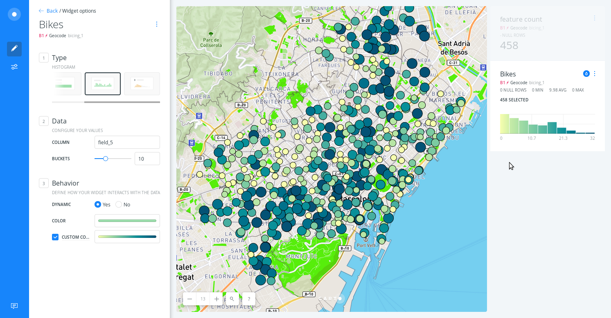
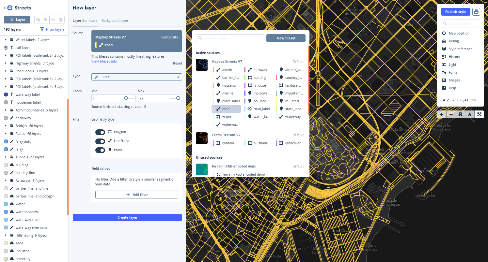
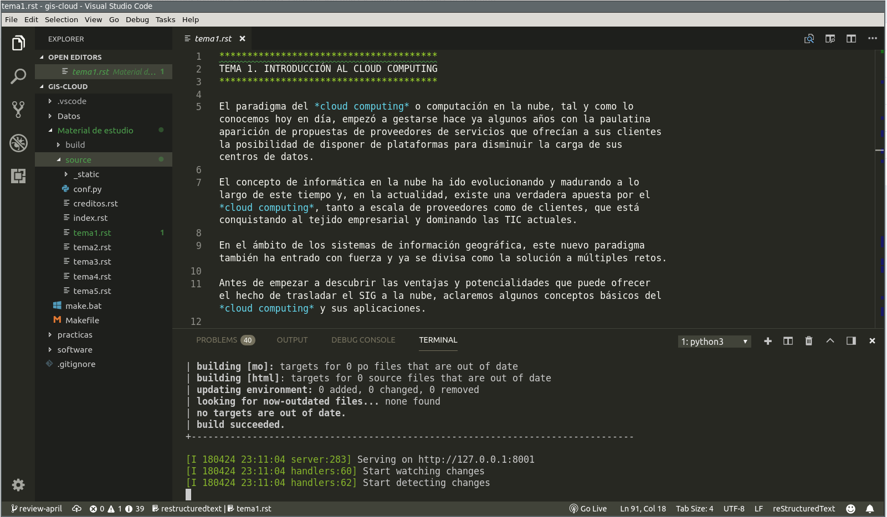

Por segundo año tutorizo el curso de [GIS Cloud](http://www.unigis.es/cursos-de-especializacion-sig/gis-cloud/) en el máster a distancia [UNIGS](http://www.unigis.es). El curso se ofrece tanto como módulo para los alumnos del [máster profesional en SIG](http://www.unigis.es/master/) como curso de especialización abierto a cualquiera que quiera profundizar en esta temática.

El curso se desarrolla entre el **14 de mayo y el 25 de junio** y el período de [inscripción](http://www.fundacioudg.org/ca/curs-especialitzacio-gis-cloud.html) acaba el **7 de mayo** con un precio de **375 euros**, bonificables a través de la [Fundación Estatal para la Formación en el Empleo](https://www.fundae.es/Pages/default.aspx) (anteriormente conocida como Fundación Tripartita).

El año pasado fue una experienca muy interesante. Como trabajador en remoto y además miembro de un equipo de soporte, la metodología didáctica de los cursos de UNIGS me resulta totalmente **familiar**. Desde sus casas o centros de trabajo los alumnos siguen los materiales a su ritmo y disponen de varios foros (en función del tipo de duda) para preguntar. Es muy interesante ver cómo poco a poco la gente se suelta y cómo acaban por ayudarse entre ellos. Para mí son unas semanas ajetreadas, de intentar resolver las dudas lo más rápido posible y a la vez dar la mejor información complementaria para que puedan aprender el máximo. A la vez algunos hasta descubren que se pueden incrustar gifs animados casi en cualquier lado 😄.

Personalmente creo que el curso me enriquece a mí tanto como a los alumnos, porque nada te da mejor perspectiva que el _feedback_ que te devuelven aquellos que llegan por primera vez, con pocos prejuicios y diferenets _backgrounds_.

El temario es básicamente el mismo del año pasado con las inevitables actualizaciones de pantallas y pequeños detalles pero en general la estructura me parece muy balanceada para el tiempo del que disponen:

- Una introducción genérica a qué son los servicios en la nube en general
- Primera aproximación con Google Fusion Tables, un servicio ya veterano pero que sigue siendo muy válido para trabajar con datos sencillos
- Luego seguimos con Mapbox, el mejor servicio (tanto entre los productos libres como privativos) para diseñar mapas vistosos y potencialmente complejos. Mapbox Studio es una herramienta que no te la acabas.
- Acabamos con CARTO Builder, un completo SIG en la nube con el que hacer análisis y publicar cuadros de mando que van más allá de un simple mapa.

\[caption id="attachment\_1180" align="aligncenter" width="1493"\] Usando CARTO Builder para ver datos del servicio municipal de alquiler bicicletas de Barcelona\[/caption\]

En realidad como en cualquier curso de este tipo, lo importante es **aprender a valorar las herramientas**, encontrar sus puntos fuertes y sus puntos débiles así como desarrollar las capacidades para criticar cualquier otro servicio al que los alumnos se enfrenten en el futuro. Como decía un excompañero de trabajo, _es esto mismo lo que nos hace tecnólogos en lugar de simples operadores de un software concreto_.

\[caption id="attachment\_1181" align="alignnone" width="1495"\] Mapbox Studio es gloria bendita\[/caption\]

Finalmente comentar que **me encanta** el flujo de trabajo que la gente del SIGTE lleva, usando para el control de la documentación repositorios git con tareas y _pull requests_ asociadas y [Sphinx](http://www.sphinx-doc.org) para la edición de la documentación. Se nota que tienen mucha experiencia y **saben lo que hacen**.

\[caption id="attachment\_1179" align="aligncenter" width="1601"\] Poder escribir en restructuredText y mantener un control de cambios "sano" no se paga con dinero\[/caption\]

Pues nada, eso es todo, que si lo que he contado te parece interesante y te apetece dedicar unas semanas de esta primavera a aprender más sobre los SIG en la nube, nos vemos en el Moodle de UNIGIS 😉.
