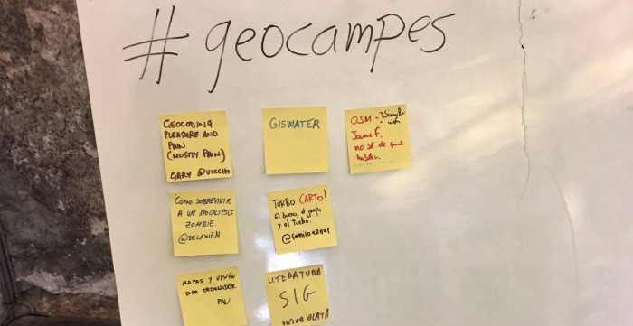

Se abre la [inscripción](http://2019.geocamp.es/#inscripci%C3%B3n) a la [**GEOCAMP 2019**](http://geocamp.es/) que se celebrará el próximo **sábado 15 de junio** en el [Museu Comarcal de L’Horta Sud](http://2019.geocamp.es/museu/), Torrent (Valencia).  El aforo está limitado a **60 personas** por lo que recomendamos la inscripción a la actividad lo antes posible.

Para los que no conozcáis este evento, se trata de una **desconferencia** (tipo [Barcamp](https://es.wikipedia.org/wiki/BarCamp)) donde todo el mundo está invitado a participar. No hay agenda, no hay oradores confirmados, no hay charlas patrocinadas, cualquier _tema relacionado con las ciencias de la Tierra_ es bienvenido. Ven y cuéntanos lo que te **apasiona** y **aprende** de otras experiencias y proyectos.

Al comienzo de la jornada nos reuniremos y se recogerán propuestas de **charlas** o cualquier otra **actividad** de no más de **20 o 30 minutos**. Una vez recopiladas las ordenamos de manera que tengan la mayor consistencia y procedemos con la jornada. Así de simple.

Además, este año se ha hecho coincidir este evento el mismo fin de semana que otro evento conocido como [**Geopaella**](http://2019.geocamp.es/geopaella/)**,** que se viene realizando desde [Geoinquietos Valencia](http://geoinquietos.org/grupos/valencia/) desde hace ya algunos años. Se trata de una reunión el mismo **domingo 16 de junio** para charlar de forma distendida sobre temas geoespaciales en buena compañía, con “auténtica” paella valenciana y en un **_espacio privado integrado en la huerta valenciana en la pedanía de Borbotó en l’Horta Nord (_**[_Descubre L´Horta_](https://www.google.com/maps/place/Carrer+Josep+Renau,+44,+46016+Borbot%C3%B3,+Val%C3%A8ncia/@39.5140851,-0.3918462,17z/data=!3m1!4b1!4m5!3m4!1s0xd6045c707cb72cf:0xf7014bdb78e53067!8m2!3d39.5140851!4d-0.3918462)**_)_**. Los nuevos asistentes y los geoinquietos que repiten suelen valorar la clase magistral que da Fernando para saber preparar una buena paella con la materia prima recogida directamente de sus campos y en un entorno natural como la huerta, así como una gran sobremesa que se suele alargar hasta el atardecer. Hay más información y detalles para la inscripción en la página para la [Geopaella 2019](http://2019.geocamp.es/geopaella/).

¡¡Esperamos vuestra asistencia y vuestras contribuciones al evento!!

_Mail:_  [info@geocamp.es](mailto:info@geocamp.es) _Twitter:_ [@geocampes](https://twitter.com/geocampes) ( [_#geocampes_](https://twitter.com/search?q=%23geocampes&src=typd) ) _Web:_ [http://geocamp.es/](http://geocamp.es/)
